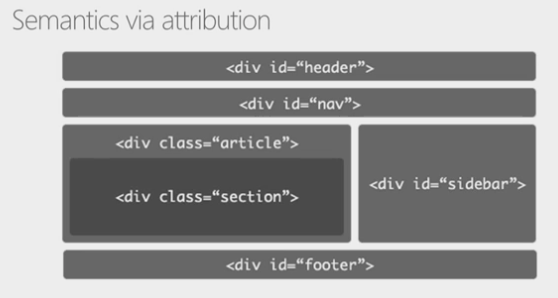
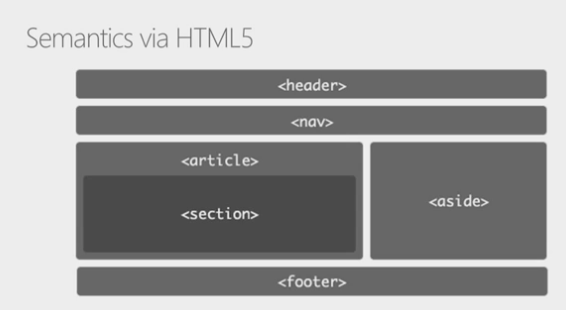
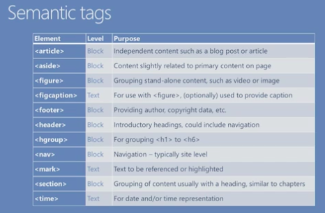
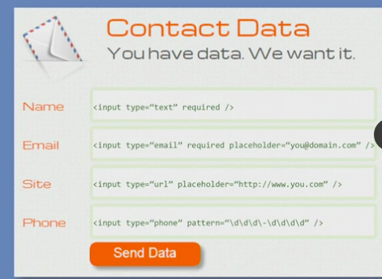
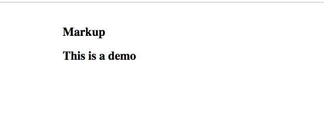
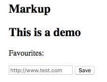
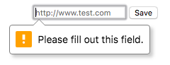
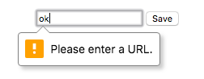
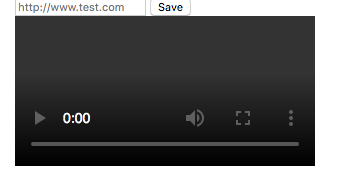

# Module 1: HTML5 Semantic Structure <!-- omit in toc -->

- [Semantic tags](#Semantic-tags)
  - [Semantics via attribution](#Semantics-via-attribution)
  - [New semantic tags](#New-semantic-tags)
- [Forms](#Forms)
- [Audio/Video](#AudioVideo)
  - [Audio](#Audio)
  - [Video](#Video)
- [Canvas](#Canvas)
- [SVG](#SVG)
- [Demo](#Demo)
  - [Semantic and forms](#Semantic-and-forms)
  - [Audio and video](#Audio-and-video)
- [Supplementary](#Supplementary)
  - [HTML5 doc structure](#HTML5-doc-structure)
- [Example questions](#Example-questions)

---

## Semantic tags

### Semantics via attribution



Things that people create a lot - e.g headers, sections, etc - lots of repetition in using ids and classes in divs.

Semantic tags remove the need for that and add tags specific to different areas



### New semantic tags

- `<article>`
- `<aside>`
- `<figure>`
- `<figcaption>`
- `<footer>`
- `<header>`
- `<hgroup>`
- `<nav>`
- `<mark>`
- `<section>`
- `<time>`



---

## Forms

- required - field is mandatory - can use `required` or `required="required"`
- placeholder - the default contents of the form field
- pattern - can provide regex to the form field to add validation



---

## Audio/Video

### Audio

How you can implement audio into a page

```html
<audio src-"some.mp3" controls></audio>
<audio controls autoplay loop preload="auto">
    <source src="some.ogg" />
    <source src="some.mp3" />
    Your browser does not support audio!
</audio>
```

`controls` - shows controls related to audio

second example shows fallback for different formats - e.g. if made it through the ogg and mp3 will present text to the user

### Video

Similar to audio

```html
<video src-"some.mp4" controls></video>
<video controls autoplay loop muted>
    <source src="some.webm" />
    <source src="some.mp4" />
    Your browser does not support video!
</video>
<video width="400" height="300">...</video>
<video preload="none" poster="some.jpg">
    ...
</video>
```

Can have controls and back up strategy but you can also set the width and height.  Also a placeholder image (`poster`)

---

## Canvas

Canvas allows drawing on the screen

Initially create the space

```html
<canvas id="can" width="200" height="200">
    Your browser does not support canvas
</canvas>
```

Then add JavaScript to interact with it

```js
//JavaScript
var canvas = document.getElementById("can")
var ctx = canvas.getContext("2s")
ctx.fillStyle = "rgb(0,0,255)"
ctx.fillRect(10, 10, 180, 180)

```

---

## SVG

Scalable Vector Graphics

```html
<svg width="200" height="200">
    rect fill="rgb(0,0,255)"
        x="10"
        y="10"
        width="180"
        height="180" />
</svg>
```

SVG benefits - every feature of SVG can be identified as an object through the DOM and be manipulated.

In canvas the things that move or as part of the canvas are not objects that can be manipulated directly.

---

## Demo

[Demo](./demo/1-demo.html)

### Semantic and forms

```html
<!DOCTYPE html>
<html>
<head></head>
<body>
    <section style="margin-left:120px;margin-top:45px;">
        <hgroup>
            <h1>Markup</h1>
            <h2>This is a demo</h2>
        </hgroup>
    </section>
</body>
</html>
```



```html
        <p>Favourites:</p>
        <form>
            <input id="favUrl" type="url" required="required" placeholder="http://www.test.com" />
            <input type="submit" value="Save">
        </form>
```



Clicking save gets you this



Entering something not a url



---

### Audio and video

```html
<form onsubmit="bmo.play();return false;">
            <input id="favUrl" type="url" required="required" placeholder="http://www.test.com" />
            <input type="submit" value="Save">
        </form>
        <audio src="./audio/bmo_cry.mp3" id="bmo"></audio>
```

This has added an `onsubmit` to the form which calls the `play` function of the audio.  `return false` stops the form from submitting.

Now for video

```html
        <video src="./video/video_test.mp4" id="vid" controls="controls"></video>
```



---

## Supplementary

### HTML5 doc structure

```html
<!DOCTYPE html>
<html>
<head></head>
<body>
    <p>Content goes here</p>
</body>
</html>
```

---

## Example questions

[Module 1](./example-questions/1-example-questions.pdf)

Question 2 incorrect/typo
