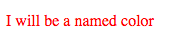
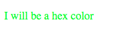
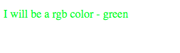
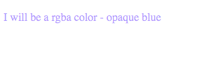
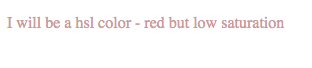
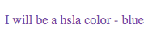
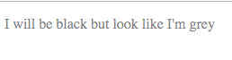
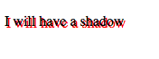
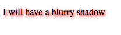
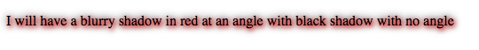

# Module 2 - CSS Selectors and Style Properties

**C**ascading **S**tyle **S**heets

- [Module 2 - CSS Selectors and Style Properties](#Module-2---CSS-Selectors-and-Style-Properties)
  - [Selectors](#Selectors)
    - [type selectors](#type-selectors)
    - [.class selectors](#class-selectors)
    - [the universal selector](#the-universal-selector)
    - [#id selectors](#id-selectors)
    - [[attribute] selectors](#attribute-selectors)
    - [:pseudo-class and ::pseudo-element selectors](#pseudo-class-and-pseudo-element-selectors)
      - [pseudo-element](#pseudo-element)
      - [pseudo-class](#pseudo-class)
    - [selector chains, selector chains, selector chains](#selector-chains-selector-chains-selector-chains)
  - [Combinators](#Combinators)
    - [decendant combinator](#decendant-combinator)
    - [child > combinator](#child--combinator)
    - [general ~ sibling](#general--sibling)
    - [adjacent + sibling](#adjacent--sibling)
  - [Color properties](#Color-properties)
    - [color](#color)
      - [named color](#named-color)
      - [hex (#)](#hex)
      - [rgb()/rgba()](#rgbrgba)
      - [hsl()/hsla()](#hslhsla)
    - [opacity](#opacity)
  - [Text properties](#Text-properties)
  - [Font properties](#Font-properties)
  - [Box properties](#Box-properties)
  - [Demo](#Demo)
  - [Supplementary](#Supplementary)
    - [Style rules syntax](#Style-rules-syntax)
  - [Example questions](#Example-questions)

## Selectors

### type selectors

Refers to the type of html - e.g. table, ul

```css
table { color: red;}
```

Also cascades down to the child tags (td, tr, etc) of the table

```css
ul { color: red;}
```

### .class selectors

Classes don't need to be unique.  Way of describing the element

```html
<div class="fancy">Fancy</div>
<div class="fancy bold">Fancy AND bold</div>
```

```css
.fancy { color: red;}
.bold { font-weight: bold;}
```

div 1 will just be red, div 2 will be red and bold


### the universal selector

Note that the above css is essentially the same as

```css
*.fancy { color: red;}
*.bold { font-weight: bold;}
```

the `*` is the universal type selector.  Which means **all** of the tags with the class of fancy.

You could also specify only a div with the class of fancy be affected

```css
div.fancy { color: red;}
```

### #id selectors

id will be unique
  
```html
<div id="div1">Fancy</div>
<div id="div2">Bold</div>
```

```css
#div1 { color: red;}
#div2 { font-weight: bold;}
```


### [attribute] selectors

`data-<anything you want>`

```html
<div id="div1" data-author="me">Fancy</div>
<div id="div2" data-author="you">Bold</div>
<div id="div3" data-author="youAndme">Bold</div>
<input type="text" required="required">
<input type="text" >
```

```css
[data-author] { color: red;}
[data-author=you] { font-weight: bold;}
[data-author$=me] { font-weight: bold; font-size: 10pt;}
[data-author^=you] { font-weight: bold; font-size: 10pt;}
[data-author*=And] { color: green; font-size: 10pt;}
[required] { color: blue;}
```


* `$=` = ends with
* `^=` = begins with
* `*=` = contains

### :pseudo-class and ::pseudo-element selectors

#### pseudo-element
```html
<p>I am a paragraph</p>
<p>I am another slightly longer paragraph</p>
```

```css
p::first-letter { color: red;}
```

e.g.
- `first-letter`
- `first-line`


#### pseudo-class

```html
<p>I am a paragraph - hover over me to make me red</p>
<ul>
    <li>I am first</li>
    <li>I am second</li>
    <li>I am third</li>
</ul>
```

```css
p:hover { color: red;}
```


other pseudo classes

```html
<p>I am a paragraph - hover over me to make me red</p>
<ul>
    <li>I am first - I can be pink</li>
    <li>I am second</li>
    <li>I am third - I am blue</li>
</ul>
<ul>
    <li>I am first - I can be pink</li>
    <li>I am second</li>
    <li>I am third - I am blue</li>
    <li>I am fourth</li>
    <li>I am fifth - I am orange</li>
</ul>
```

```css
p:hover { color: red; }
li:first-child {color: pink }
li:nth-child(3) {color: blue }
li:nth-of-type(5) {color: orange }
```

with `nth-child` - can also specify formula if desired

also `nth-of-type`


### selector chains, selector chains, selector chains

```css
table, ul { color: red;}
```

Note that combining selectors stops at the comma

```css
div table, ul { color: red;}
```

is not the same as

```css
div table, div ul { color: red;}
```

---

## Combinators

Ways of combining simple selectors in css so that they apply to targetted sections

Helps with scoping

### decendant combinator

Denoted by a space.  Means any decendant no matter how deep

```html
<div id="div1">
    <p>I will not go red</p>
    <div>Fancy - I am red
        <div>I will also be red</div>
    </div>
</div>
<div id="div2">Bold</div>
```

```css
#div1 div { color: red;}
#div2 { font-weight: bold;}
```

In this example, `div` is a decendant of the id `div1`.  Will affect direct descendants as well as deeper decendants.


### child > combinator

Specifies that it's only a direct decendant affected

```html
<div id="div1">
    <p>I will not go red</p>
    <div>Fancy - I am red
        <div>I will not be red this time</div>
    </div>
</div>
<div id="div2">Bold</div>
```

```css
#div1 > div { color: red;}
#div2 { font-weight: bold;}
```

### general ~ sibling

Sibling but doesn't have to be immediate sibling

```html
<div id="div1">
    <p>I will not go red because of the order in the selectors</p>
    <div>not red
        <div>not red either</div>
    </div>
    <p>paragraph</p>
    <h1>heading</h1>
    <p>I will be red because I have a div sibling before me somewhere</p>
</div>
<p id="p">I'll be red too</div>
```

```css
div ~ p { color: red;}
#div2 { font-weight: bold;}
```

Order is important.  But doesn't have to directly be next to each other


### adjacent + sibling

Now has to be directly next to each other

```html
<div id="div1">
    <p>I will not go red because of the order in the selectors</p>
    <div>I am not red
        <div>not red</div>
    </div>
    <p>paragraph - I am red</p>
    <h1>heading</h1>
    <p>I will NOT be red this time because I have an h1 in the way between me and my preceding div sibling</p>
</div>
<p id="p">I'll be red too</div>
<ul>
    <li>I am first</li>
    <li>I am second - I am pink</li>
    <li>I am third - I am pink too</li>
</ul>
```

```css
div + p { color: red;}
#div2 { font-weight: bold;}
li + li {color: pink}
```

This is an alternate way of doing something that you could do (better) with first-child pseudo selector


---

## Color properties

### color

#### named color

Couple of hundred available

```html
<p>I will be a named color</p>
```

```css
p {color: red}
```



#### hex (#)

- first 2 red
- second 2 green
- third 2 blue

So: 
- `#000000` - black
- `#ffffff` - white

3 pairs - if each pair is identical you can specify with only 3

- `#000` - black
- `#fff` - white

```html
<p>I will be a hex color</p>
```

```css
p {color: #00ff00}
```



#### rgb()/rgba()

Takes 3 numbers from 0 to 255

```html
<p>I will be a rgb color - green</p>
```

```css
p {color: rgb(0, 255, 0)}
```



RGBA expects another value which is the opacity. 0-1 value

```html
<p>I will be a rgba color - opaque blue</p>
```

```css
p {color: rgba(0, 0, 255, 0.4)}
```



#### hsl()/hsla()

hue, saturation, lightness

Takes 3 numbers:
- hue - 0-255
- saturation - percentage (lower number, lower saturation)
- lightness - how much/little black - percentage (higher number, the lighter it is)

```html
<p>I will be a hsl color - red but low saturation</p>
```

```css
p {color: hsl(0, 30%, 70%)}
```



hsla expects another value which is the opacity. 0-1 value

```html
<p>I will be a hsla color - blue</p>
```

```css
p {color: hsla(255, 80%, 30%, 0.7)}
```


### opacity

In addition to affecting opacity by rgba and hsla, you can do it directly

```html
<p>I will be black but look like I'm grey</p>
```

```css
p {opacity: 0.5}
```



---

## Text properties

- `text-decoration: overline | underline | line-through`
- `text-transform: none | lowercase | uppercase | capitalize`
- `text-shadow` (i.e. 2px 2px grey) (direction-right direction-bottom [blur] color)

    ```html
    <p>I will have a shadow</p>
    ```

    ```css
    p {text-shadow: 2px 2px red}
    ```

    

    Adding in a 3rd value adds the blur factor

    ```html
    <p>I will have a blurry shadow</p>
    ```

    ```css
    p {text-shadow: 2px 2px 5px red}
    ```

    

    Can also add another shadow on top - this one defaults to black but can add a color

    ```html
    <p>I will have a blurry shadow in red at an angle with black shadow with no angle</p>
    ```

    ```css
    p {text-shadow: 2px 2px 5px red,0 0 10px}
    ```

    

---

## Font properties


---

## Box properties

---

## Demo

---

## Supplementary

### Style rules syntax

```css
selector {
    property: value;
    property: value;
}
```

Flat language with selectors and style rules.

`selector` - What you want to affect
`property:value;` pair - How you want to affect it

---

## Example questions

[Module 2](./example-questions/2-example-questions.pdf)
