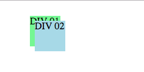
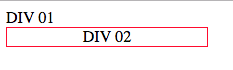
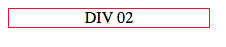
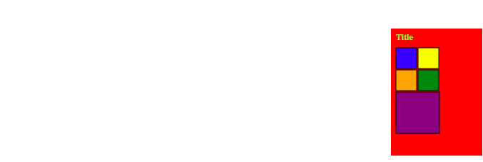
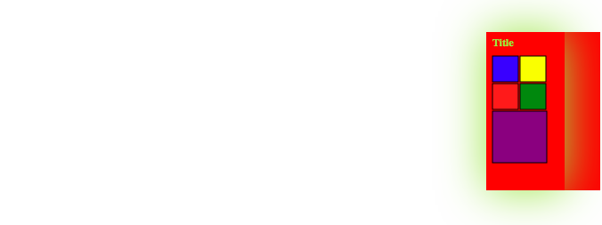
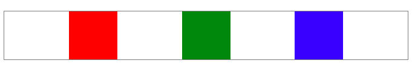

# Module 3 - Advanced layout and Animations <!-- omit in toc -->

- [Legacy layouts](#Legacy-layouts)
  - [positioning and z-index](#positioning-and-z-index)
  - [display](#display)
  - [float](#float)
  - [Legacy demo](#Legacy-demo)
- [Flexbox](#Flexbox)
  - [horizontal or vertical](#horizontal-or-vertical)
  - [packing](#packing)
  - [alignment](#alignment)
  - [Putting it all together](#Putting-it-all-together)
  - [flex](#flex)
  - [wrapping](#wrapping)
- [Grid](#Grid)
- [Transforms](#Transforms)
- [Transitions and Animations](#Transitions-and-Animations)
- [Demo](#Demo)
- [Supplementary](#Supplementary)
- [Example questions](#Example-questions)

---

## Legacy layouts

### positioning and z-index

- `position`
  - `absolute` - position based on the document position
  - `relative` - preserve where it would be in original markup and position relative to that
- `z-index` - higher number, on the top

Can be used to exactly position elements

```css
#id01 {
    background-color: lightgreen;
    width: 50px;
    height: 50px;
    position: absolute;
    top: 25px;
    left: 50px;
    z-index: 0;
}
#id02 {
    background-color: lightblue;
    width: 50px;
    height: 50px;
    position: relative;
    top: 25px;
    left: 50px;
    z-index: 1;
}
```

```html
<div id="id01">DIV 01</div>
<div id="id02">DIV 02</div>
```



---

### display

```css
.vanish {
    display: none;
}
.centered {
    display: table-cell;
    min-height: 200px;
    min-width: 200px;
    text-align: center;
    vertical-align: middle;
    border: 1px solid #ff4444;
}
```

```html
<div class="vanish">DIV 01</div>
<div class="centered">DIV 02</div>
```

without `display: none`



with `display: none`



`display: table-cell` is useful for centering.  Allows vertical align to behave itself

`vertical-align` may not always work depending on the element it's in.

---

### float


---

### Legacy demo

[demo](./demo/3-demo-legacy.html)



on hover



---

## Flexbox

Gives control over child elements

### horizontal or vertical

Child items can be laid out horizontally or vertically.  Left to right or vice versa and top to bottom and vice versa

### packing

Alignment of the child items along the axis of layout.  So for horizontal, controls spacing between child items

---

### alignment

Alignment of the child items perpendicular to the axis of layout.  So for horizontal, controls vertical alignment

---

### Putting it all together

The essential building block of a flexbox is:
- `display: flex`

```html
<div class="flexbox">
    <div id="flexbox1">
        <div></div>
        <div></div>
        <div></div>
    </div>
</div>
```

```css
.flexbox #flexbox1 {
    margin-top: 20px;
    display: flex;
    width: 100%;
    /* -ms-flex-pack:distribute;
    -webkit-box-pack:justify; */
    justify-content: space-evenly;
    border: 1px solid grey;
}

.flexbox #flexbox1 > div { min-width: 80px; min-height: 80px;}
.flexbox #flexbox1 > div:nth-child(1) {background-color: red;}
.flexbox #flexbox1 > div:nth-child(2) {background-color: green;}
.flexbox #flexbox1 > div:nth-child(3) {background-color: blue;}

```



---

### flex

`flex: 1 0 auto`

- relative amount of flex - relative to all other children, how much should it flex.  `flex: 2 0 auto` is twice as big as `flex: 1 0 auto`
- recommended size

```html
<div class="flexbox">
    <div id="flexbox2">
        <div></div>
        <div></div>
        <div></div>
    </div>
</div>
```

```css
.flexbox #flexbox2 {
           margin-top: 20px;
           display: flex;
       }

       .flexbox #flexbox2 > div { min-width: 80px; min-height: 80px;}
       .flexbox #flexbox2 > div:nth-child(1) {background-color: red; flex: 1 0 auto;}
       .flexbox #flexbox2 > div:nth-child(2) {background-color: green; flex: 2 0 auto;}
       .flexbox #flexbox2 > div:nth-child(3) {background-color: blue;}

```


You can see that the first 2 are flexing and the 3rd is just the original div size specified (80px x 80px)

Then in the remaining space red takes up 1 space, and green takes up 2 spaces

---

### wrapping

```html
<div class="flexbox">
    <div id="flexbox3">
        <div></div>
        <div></div>
        <div></div>
        <div></div>
        <div></div>
        <div></div>
        <div></div>
        <div></div>
        <div></div>
    </div>
</div>
```

```css
.flexbox #flexbox3 {
    margin-top: 20px;
    display: flex;
    flex-wrap: wrap;
    width: 100%;
}

.flexbox #flexbox3 > div {
    min-width: 40px;
    min-height: 40px;
    background-color: grey;
    margin: 5px;
    font-size: 60px;
    padding: 15px;
}

.flexbox #flexbox3 > div:nth-child(7) {
    background-color: red;
}
```


---

## Grid


---

## Transforms


---

## Transitions and Animations


---

## Demo

---

## Supplementary


---

## Example questions

[Module 3](./example-questions/3-example-questions.pdf)
