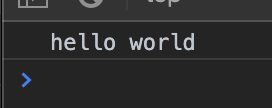

# Module 4 - JavaScript Core Capabilities <!-- omit in toc -->

- [Overview](#Overview)
  - [History](#History)
  - [Language characteristics](#Language-characteristics)
- [Variables](#Variables)
- [Functions](#Functions)
  - [Functions](#Functions-1)
  - [Methods](#Methods)
- [Function Scope](#Function-Scope)
  - [Scope](#Scope)
  - [Functions in Functions](#Functions-in-Functions)
  - [Immediate Functions](#Immediate-Functions)
  - [Module Pattern](#Module-Pattern)
- [Function Demo](#Function-Demo)
- [Arrays](#Arrays)
  - [Declaration](#Declaration)
  - [Array functions](#Array-functions)
- [Objects](#Objects)
- [Example questions](#Example-questions)

---

## Overview

### History

- 1995: started in browser - created as a means to interact with client
- 1997: formalized by ECMAScript
- 2009: moved to the backend (node.js)
- 2012: moved to the client Windows 8
- ........

---

### Language characteristics

- prototype-based
- dynamic and weakly-typed
- first-class functions
- C-like syntax

---

## Variables

- types (string, number, boolean, array, object, null, undefined)
  
  ```js
  var myString = "hello world";
  var myBool = true;
  console.log(myString)
  ```

  

- declarations

---

## Functions

### Functions
```js
function justDo() { }

function getSomething() { return something;}

function doWithArg(arg) {
  //use arg
}

function doWithArgs(arg1, arg2) {
  //use arg1 or arg2
}
```

---

### Methods

Method is a function, but it's a named property inside the object

```js
var ops = {
  add: function addNumbers(n1, n2) {
    return n1 + n2;
  }
};

var x = ops.add(3, 5); // x == 8
var y = ops.addNumbers(3, 5); // not valid
```

function named `add` which is a member of `ops`

can't call `addNumbers` because its hidden.

See Function Scope

---

- callable behaviors
- implemented as objects
- hoisting

  Functions can be called before they have been declared (depending on how its been defined)
  
  ```js
  console.log(f1)
  console.log(f2)

  function f1() {

  }

  var f2 = function () {

  };
  ```

  

  `f2` has not been defined as a function yet so therefore it's undefined.  As `f1` has used the standard function set up it has been hoisted.

- arguments

  ```js
  console.log(f1("one", 2, 0.78, {}, []))

  function f1() {
    debugger;
  }
  ```

  This opens the debugger, then go to console and type `arguments`

  

  Can also refer to the individual arguments - e.g. `arguments[3]` will return the 4th item

---

## Function Scope

- defining what is accessible in code and where
  
  Should only have access to the functions that you need.  Simpler but also safer as can't affect functions/variables you shouldn't be using or that shouldn't be reset

- encapsulation
  
  Object oriented terminology

---

### Scope

```js
var x = 2000;

function someFunc() {
  var y = 12;
  return y
}

var z = x + y; //invalid use of y as y is an internal variable of the someFunc function
var z = x + someFunc(); //z == 2012
```

variables declared inside of a function are not accessible outside of the function directly.  Would need to be returned.

---

### Functions in Functions

```js
function outerFunction(n) {
  function innerFunction() {
    return n * n;
  }
  return innerFunction();
}

var x = outerFunction(4); //x == 16

// innerFunction cannot be called directly
```

---

### Immediate Functions

Self executing functions

You want to have the code to execute as it's being processed

Execute immediately.

Need to be careful in using these.

Advantage is that what it's doing is hidden from view

```js
(function() {  }());
```

or

```js
(function() {  })();
```


---

### Module Pattern

Makes use of immediate functions

```js
var mod = (function(){
  var m = 2000, c = 0, d = 10, y = 2;
  return {
    getHiddenYear : function() {
      return m + c + d + y;
    }
  }
}())

var x = mod.getHiddenYear(); // x == 2012
```

`mod` = the result of calling an immediate function.  The declared variables are not in any outer scopes.

Careful with architectural use of these

---

## Function Demo

```js
function add(n1, n2) {
  return n1 + n2
}

function calc(n1, n2, processForCalc) {
  return processForCalc(n1, n2);
}

function executeMath() {
  console.log(calc(4, 4, add));
}

executeMath() // 8
```

`calc(4, 4, add))` - the add here is passing in the function

---

## Arrays

- simple declaration/instantiation
- array functions: push, pop, concat, map, filter, some, every, forEach, reduce, sort, splice, join, reverse

### Declaration

```js
var fruit = ['orange', 'pear', 'pineapple', 'apple'];
console.log(fruit) // ['orange', 'pear', 'pineapple', 'apple']
```

### Array functions

- sort
  
  ```js
  var fruit = ['orange', 'pear', 'pineapple', 'apple'];
  console.log(fruit.sort()) // ['apple', 'orange', 'pear', 'pineapple']
  ```

- push
  
  Add value to end of array

  ```js
  var fruit = ['orange', 'pear', 'pineapple', 'apple'];
  console.log(fruit.push('apricot')) // 5
  console.log(fruit.sort()) // ["apple",  "apricot",  "orange",  "pear",  "pineapple"]
  ```

- pop

  ```js
  var fruit = ['orange', 'pear', 'pineapple', 'apple'];
  console.log(fruit.pop()) // apple
  console.log(fruit) // ['orange', 'pear', 'pineapple']
  console.log(fruit.pop(2)) // pineapple
  console.log(fruit) // ["orange",  "pear"]
  ```

- concat

  Immutable so just returns the value, doesn't change the array

  ```js
  var fruit = ['orange', 'pear', 'pineapple', 'apple'];
  var vegetable = ['onion', 'potato', 'green bean']
  fruit = fruit.concat(vegetable)
  console.log(fruit) // ["orange","pear","pineapple","apple","onion","potato","green bean"]
  ```

- slice

  `fruit.slice(0,1)` - starts index of 0 and going to index value of 1 return the items

  ```js
  var fruit = ['orange', 'pear', 'pineapple', 'apple'];
  fruit = fruit.slice(0,1);
  console.log(fruit) // ['orange']
  fruit = fruit.slice(1,3);
  console.log(fruit) // ['pear','pineapple']
  ```

- splice

  mutable - so changes array

  ```js
  var fruit = ['orange', 'pear', 'pineapple', 'apple', 'cherry'];
  fruit.splice(1,2,'apricot','strawberry');
  console.log(fruit) // ["orange","apricot","strawberry","apple","cherry"]
  ```

- map

  Opportunity to transform items in the array (projection)

  Can be moditication of the item, no modification

  ```js
  var fruit = ['orange', 'pear', 'pineapple', 'apple', 'cherry'];
  fruit = fruit.map(function(item, index) {
    return item.toUpperCase();
  })
  console.log(fruit) // ["ORANGE","PEAR","PINEAPPLE","APPLE","CHERRY"]
  fruit = fruit.map(function(item, index) {
    return {fruitName: item}
  })
  console.log(fruit) 
  // [ { "fruitName": "ORANGE" },
  //   { "fruitName": "PEAR" },
  //   { "fruitName": "PINEAPPLE" },
  //   { "fruitName": "APPLE" },
  //   { "fruitName": "CHERRY" } ]
  ```

- filter

  similar to map but this takes a check that will return true or false for each item.  if true it remains in the array, if false it is removed

  ```js
  var fruit = ['orange', 'pear', 'pineapple', 'apple', 'cherry'];
  fruit = fruit.filter(function(item, index) {
    return item[0] === 'a';
  })
  console.log(fruit) // ['apple']
  ```

- every

  if all items in the array match the test then true otherwise false

  ```js
  var fruit = ['orange', 'pear', 'pineapple', 'apple', 'cherry'];
  
  console.log(fruit.every(function(item, index) {
    return item[0] === 'a';
  })) // false

  console.log(fruit.every(function(item, index) {
    return item.length > 0;
  })) // true
  ```

- some
  
  if some of the items in the array match the test then true otherwise false

  ```js
  var fruit = ['orange', 'pear', 'pineapple', 'apple', 'cherry'];
  
  console.log(fruit.some(function(item, index) {
    return item[0] === 'a';
  })) // true

  console.log(fruit.some(function(item, index) {
    return item.length < 1;
  })) // false
  ```

- forEach

  ```js
  var fruit = ['orange', 'pear', 'pineapple', 'apple', 'cherry'];

  fruit.forEach(function(item){
    console.log(item)
  })
  ```


<details>
<summary>More examples</summary>

```js
var a = [1, 2, 3, 4, 5, 6, 7, 8, 9];
var s = ["alpha", "bravo", "charlie", "delta", "echo", "foxtrot", "golf", "hotel", "india"];
```
  
- map
  
  ```js
  var aPlus1 = a.map(function (i) { return i + 1; });
  console.log(aPlus1) // [2, 3, 4, 5, 6, 7, 8, 9, 10]
  ```

- filter
  
  ```js
  var bigNumbers = a.filter(function (i) { return i > 5; });
  console.log(bigNumbers) // [6, 7, 8, 9]
  ```

- some
  
  ```js
  var hasCharlie = s.some(function (i) { return i == "charlie"; });
  console.log(hasCharlie) // true
  ```

- every
  
  ```js
  var allPositive = a.every(function (i) { return i >= 0; });
  console.log(allPositive) // true
  ```

- forEach
  
  ```js
  s.forEach(function(item, index) {
    console.log(item) // alpha bravo charlie etc....
  })  ;
  ```

- reduce
  
  ```js
  var sum = a.reduce(function (previous, current) { return previous + current; });
  console.log(sum) // 45
  ```

- sort
  
  ```js
  var aReversed = a.reverse();
  console.log(aReversed); // [9, 8, 7, 6, 5, 4, 3, 2, 1]

  var sorted = aReversed.sort();
  console.log(sorted); // [1, 2, 3, 4, 5, 6, 7, 8, 9]
  ```

- splice
  
  ```js
  var aSpliced = a;
  aSpliced.splice(2, 2, "20", "21");
  console.log(aSpliced) // [1, 2, "20", "21" , 5, 6, 7, 8, 9]
  ```

</details>

---

## Objects

```js
var dog = {};
dog.breed = 'pug';
dog.bark = function() { console.log('woof');}

console.log(dog)

```

object initialiser syntax

```js
var dog = {
  breed: 'pug',
  bark: function() { console.log('woof');}
}

console.log(dog)
```

JSON syntax

(functions not allowed - can only hold static data)

```js
var dog = {
  "breed": "pug",
}

console.log(dog)
```

---

## Example questions

[Module 4](./example-questions/4-example-questions.pdf)

Question 1 incorrect/typo
