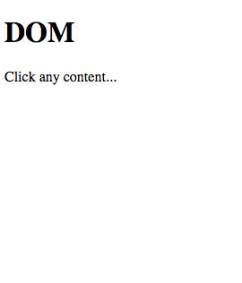

# Module 5 - DOM Interactions <!-- omit in toc -->

- [**Querying the DOM**](#Querying-the-DOM)
  - [ID](#ID)
  - [Selectors](#Selectors)
  - [Example](#Example)
  - [Debugging](#Debugging)
- [**Manipulating the DOM**](#Manipulating-the-DOM)
  - [Demo](#Demo)
- [**Responding to events**](#Responding-to-events)
  - [Declarative Event Handling](#Declarative-Event-Handling)
  - [Programmatic Event Handling](#Programmatic-Event-Handling)
    - [Demo](#Demo-1)

---

[🔼](#readme)

## **Querying the DOM**

How to access what we want

- getElementById
- getElementsByTagName
- querySelector
- querySelectorAll

### ID

```js
var x = document.getElementById("anyID");
//or
var x = document.querySelector("#anyID");
```

### Selectors

```js
var thing = document.querySelector("#anyID");
var list = document.querySelectorAll(".item");
```

---

### Example

```html
<figure id="pic">
    
    <figcaption>Fizzgig</figcaption>
</figure>
<h2>Footer</h2>
```

```js
function queryDom() {
    var x = document.getElementById("pic")
    console.log(x) // <figure id="pic"> etc </figure>
    x = document.querySelector(".picture")
    console.log(x) // 
    x = document.querySelectorAll(".picture")
    console.log(x) // NodeList [img.picture]
}
queryDom()
```

### Debugging

In the console can debug

while note in a function, can type `x` and enter to get the value of `x` and also `dir(x)` to get more info.  

`x = document.getElementById("pic")` returns the same as the function

`x = document.querySelector("h2")` will return the first h2

`x = document.querySelectorAll("h2")` returns:


Nodelists are live elements.  Capture of the elements on your page.  if a new item is added it will update

<!-- `select(x)` and enter -->

---

[🔼](#readme)

## **Manipulating the DOM**

- add | modify | remove
- change style

Quick example 

```css
.item {
    color: red;
}
```

```html
<span id="anyID">I've not changed yet</span>
```

```js
var x = document.querySelector("#anyID");
x.innerText = "changed";

x.className = "item";
//or
x.classList.add("item");
```

### Demo

[demo](./demo/5-demo-dom.html)



After some clicking


---

[🔼](#readme)

## **Responding to events**

Event Handling

- declarative binding
- programmatic binding

### Declarative Event Handling

`onclick` is on the button itself

```html
<button id="btn" onclick="handler();">Click!</button>
```

```js
function handler() { ... }
```

NOT RECOMMENDED due to the potential scoping issues

---

### Programmatic Event Handling

```html
<button id="btn">Click!</button>
```

```js
function handler() { ... }

var b = document.querySelector("#btn");
b.addEventListener("click", handler);
```

---

#### Demo

[demo](./demo/5-demo-eventhandler.html)


---

<!-- ## Example questions

[Module 5](./example-questions/5-example-questions.pdf) -->
