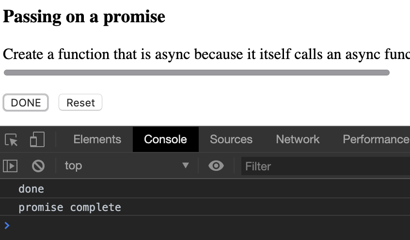

# Module 6 - JavaScript Advanced Topics <!-- omit in toc -->

- [Exception Handling](#Exception-Handling)
  - [try - catch - finally](#try---catch---finally)
  - [Throw](#Throw)
- [Promises](#Promises)
  - [Syntax](#Syntax)
  - [Demo 1](#Demo-1)
  - [Demo 2 - uses](#Demo-2---uses)
    - [**The main promise**](#The-main-promise)
    - [**Consuming a promise**](#Consuming-a-promise)
    - [**Passing on a promise**](#Passing-on-a-promise)
    - [**Creating a promise**](#Creating-a-promise)
  - [Error Handling with Promises](#Error-Handling-with-Promises)
  - [Reporting progress](#Reporting-progress)
- [Web worker](#Web-worker)
- [Web sockets](#Web-sockets)
- [Architecture Patterns](#Architecture-Patterns)
- [TypeScript](#TypeScript)
- [Example questions](#Example-questions)

---

## Exception Handling

- Managing failure in code
- Minimising failures in code

### try - catch - finally

For trying something that could potentially cause a problem.  API call, network call.

Something that would throw a runtime error rather than a syntax error.  Will it succeed in connecting for example

```js
try {
  // line(s) of suspicious code
} catch (err) {
  // .description
  // .message
  // .name
  // .number
  // .stack
} finally {
  // success or failure, code executes here
}
```

`try` the code
`catch` the `err` (use any name here) and can access the listed properties of the error
`finally` run the code.

---

### Throw

```js
function throwHelper() {
  var err = new Error(123, "Error in helper");
  throw err;
}

// elsewhere in code
try {
  throwHelper();
} catch (ex) {
  var msg = ex.number + ": " + ex:message;
  // log msg
}
```

Demo

```js
function isTypeOf(o, t) {
  if (t && t.charAt && t.charAt(0)) {
    return (Object.prototype.toString.call(o) === "[object " + t + "]");
  } else {
    throw new Error(123, "Error in helper")
    // throw new Error ("Args", "'t' required and must be a string.");
  }
}

console.log(isTypeOf({test: 'test'},'Object'))  // true
console.log(isTypeOf({test: 'test'},999)) //

```

---

## Promises

If there's a possibility that a function may take more that 50 ms then this is an async function. And must be called as such.

Can also create asynchronous functions ourselves

- Consuming a promise
- Chaining then... then... done
- Passing a promise
- Creating a promise
- Storing a promise

---

### Syntax

from [MDN](https://developer.mozilla.org/en-US/docs/Web/JavaScript/Reference/Global_Objects/Promise)

```js
var promise1 = new Promise(function(resolve, reject) {
  setTimeout(function() {
    resolve('foo');
  }, 300);
});

promise1.then(function(value) {
  console.log(value);
  // expected output: "foo"
});

console.log(promise1);
// expected output: [object Promise]
```

---

### Demo 1

[Link](./demo/6-demo-promises.html)


**Long Sync Task**

Runs a while loop for 3 seconds.  Synchronous - can't do anything until complete.  ZERO concurrency


**Long Async (no Promise)**

Implemented using `setInterval` which immediately returns but maybe that's not what you want as it will continue onto the next piece of code (maybe too soon)

Progress bar finished which is not representing a true state of the process


3rd option doesn't actually work properly due to set up of code in the source demo - will try to fix manually

---

### Demo 2 - uses

[Link](./demo/6-demo-promises-uses.html)


#### **The main promise**

```js
unction longTaskAsyncPromise(method) {
    return new Promise(function (c, e, p) {
        var seconds = 0;
        var intervalId = window.setInterval(function () {
            seconds++;
            prog(seconds, method);
            if (seconds >= SECONDS_DELAY) {
                window.clearInterval(intervalId);
                complete();
                c()
            }
        }, 1000);
    });
}
```

#### **Consuming a promise**

```js
// onclick event
method1.querySelector("button.start").onclick = function (e) {
    longTaskAsyncPromise(method1).then(function () {
        method1.querySelector("progress").value = 100;
        console.log('promise complete')
        method1.querySelector("button.start").innerHTML = 'DONE'
    });
};
```

When button is clicked we are calling the `longTaskAsyncPromise`

A promise has a `.then` function which we can use to do something once the promise finishes.  In all these cases I have added a console log and button text change.  Can chain `.then`s together


#### **Passing on a promise**

```js
// onclick event
method2.querySelector("button.start").onclick = function (e) {
    function myAsyncFunction() {
        return longTaskAsyncPromise(method2);
    }

    myAsyncFunction().then(function () {
        method2.querySelector("progress").value = 100;
        console.log('promise complete')
        method2.querySelector("button.start").innerHTML = 'DONE'
    });
};
```

When button is clicked we are declaring an async function, which then calls the `longTaskAsyncPromise` function/promise.  `myAsyncFunction` returns the `longTaskAsyncPromise` (which is a promise) to it's ultimately also returning a promise.

Can then run `.then` on `myAsyncFunction` as it's now a promise



#### **Creating a promise**

```js
// onclick event
method3.querySelector("button.start").onclick = function (e) {
    function myAsyncFunction() {
        return new Promise(function (c, e, p) {
            //do something that might take longer than 50ms
            try {
                longTaskAsyncPromise(method3).then(function () {
                    console.log('initial promise complete')
                    c();
                });
            }
            catch (err) {
                e(err);
            }
        });
    }

    myAsyncFunction().then(function () {
        method3.querySelector("progress").value = 100;
        console.log('main promise complete')
        method3.querySelector("button.start").innerHTML = 'DONE'
    });
};
```

`myAsyncFunction` creates it's own Promise inside

`return new Promise(function (c, e, p) {`

- `c` = complete
- `e` - error
- `p` - progress - think this is winJS specific

Can access all these from within the Promise

```js
try {
    longTaskAsyncPromise(method3).then(function () {
        console.log('initial promise complete')
        c();
    });
}
```

Tests that the `longTaskAsyncPromise` function is completing, `.then` calls the `myAsyncFunction` `c` (complete) to complete our promise.

```js
catch (err) {
    e(err);
}
```

Does a similar thing in the case of an error.  Not throwing the error, just reporting the error

<!-- ```js
longTaskAsyncPromise(method3).then(function () {
    console.log('initial promise complete')
    //10%
    p();
    c();
});
```

Could add in `p` (progress) and use this  -->


#### **Storing a promise**

```js
// onclick event
method4.querySelector("button.start").onclick = function (e) {

    var storedPromise = longTaskAsyncPromise(method4);

    //much time passes here

    storedPromise.then(function () {
        method4.querySelector("progress").value = 100;
        console.log('promise complete')
        method4.querySelector("button.start").innerHTML = 'DONE'
    });
};
```

Calling the `longTaskAsyncPromise` and instead of using `.then` it's being stored as `storedPromise`

Other actions may be done but can get back to the stored Promise to get an update


---

### Error Handling with Promises

Particularly with Promise chaining, each Promise can have it's own error reporting and handling.

<!-- ---

### Reporting progress

 -->

---

## Web worker


---

## Web sockets


---

## Architecture Patterns


---

## TypeScript


---

## Example questions

[Module 6](./example-questions/6-example-questions.pdf)
