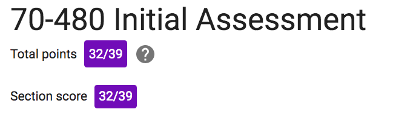
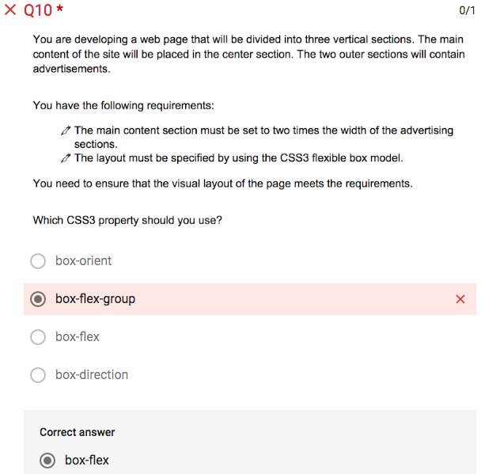
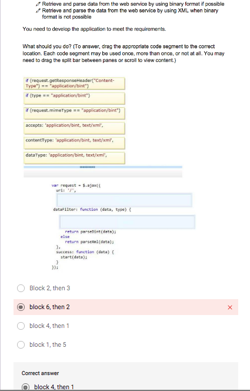
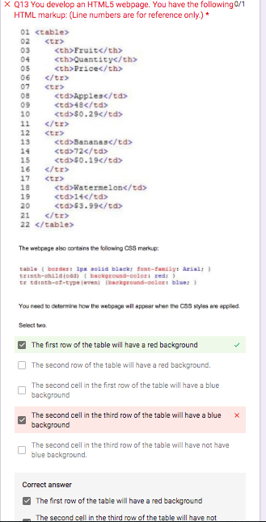
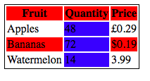
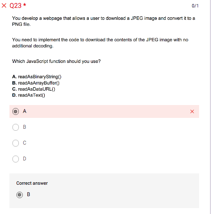
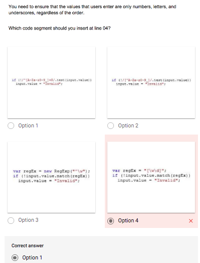
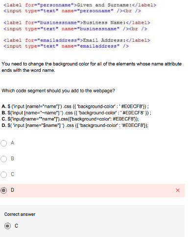
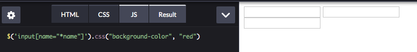
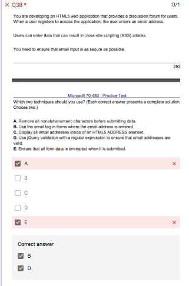

# Assessment 1 Notes <!-- omit in toc -->

[Link](https://docs.google.com/forms/d/e/1FAIpQLSfvthkRSKKGWKTq84Q-xWpkdVVmVS5J-vbhM7asXkit29Wdqg/viewform)

- [Assessment 1 Notes](#assessment-1-notes)
  - [❓](#%e2%9d%93)
  - [Results](#results)
    - [:x: Q10 - flexbox](#x-q10---flexbox)
    - [:x: Q11 - XHR](#x-q11---xhr)
    - [:x: Q13 - css](#x-q13---css)
    - [:x: Q23 - readAsArrayBuffer](#x-q23---readasarraybuffer)
    - [:x: Q24 - regex](#x-q24---regex)
    - [:x: Q34 - jquery selector (ends with etc)](#x-q34---jquery-selector-ends-with-etc)
    - [:x: Q38 - security techniques](#x-q38---security-techniques)
  - [Themes to work on](#themes-to-work-on)

---

## ❓

Not sure

- 2
- 7
- 9 - nth is 1 based, eq is 0 based
- 10
- 17
- 24 - regex
- 26
- 29
- 32 - multiple possible answers (b and d) (I chose b)
- 34 - typo? `$("input[name$='name']").css('background-color', 'red')`
- 38
- 39
- 40 - typo? missing `()` at end of line 3???
  

---

## Results

82%

[Score](https://docs.google.com/forms/d/e/1FAIpQLSfvthkRSKKGWKTq84Q-xWpkdVVmVS5J-vbhM7asXkit29Wdqg/viewscore?viewscore=AE0zAgCj2lZSTNdDPN5Gipta0GhJvOhvofFNwm2Td9c0g4DcqvQa3mAZemjyIcAwlwK5yRw)

---

### :x: Q10 - flexbox

---

### :x: Q11 - XHR

---

### :x: Q13 - css

Answer is:
- The first row of the table will have a red background
- The second cell in the third row of the table will have not have blue background.

However, this doesn't match with what I get when testing.

My answer is correct in that case.  I answered:

- The first row of the table will have a red background
- The second cell in the third row of the table will have a blue background

---

### :x: Q23 - readAsArrayBuffer

---

### :x: Q24 - regex

---

### :x: Q34 - jquery selector (ends with etc)

However, none of these actually work

`$('input[name*="name"]').css("background-color", "red")` does though

But the question said **ENDS** with - which would be

`$('input[name$="name"]').css("background-color", "red")` which is closer to what I answered as none are actually correct

---

### :x: Q38 - security techniques

---

## Themes to work on

- flexbox
- XHR
- readAsArrayBuffer
- regex
- XSS attacks - techniques for security
