# Assessment 2 Notes <!-- omit in toc -->

[Link](https://docs.google.com/forms/d/e/1FAIpQLSd67ICFd-mSzHr93Z29JNTnTfhxwEVczxleTsF3xv4ukd4oeg/viewform)

- [❓](#%E2%9D%93)
- [Results](#Results)
  - [❌ Q5 - overridden method](#%E2%9D%8C-Q5---overridden-method)
  - [❌ Q12 - overridden method](#%E2%9D%8C-Q12---overridden-method)
  - [❌ Q13 - auto vs. min-content](#%E2%9D%8C-Q13---auto-vs-min-content)
  - [❌ Q15 - pseudo and not selectors](#%E2%9D%8C-Q15---pseudo-and-not-selectors)
  - [❌ Q16 - disable form fields](#%E2%9D%8C-Q16---disable-form-fields)
  - [❌ Q17 - prototype](#%E2%9D%8C-Q17---prototype)
  - [❌ Q22 - canvas](#%E2%9D%8C-Q22---canvas)
  - [❌ Q25 - uploading files](#%E2%9D%8C-Q25---uploading-files)
  - [❌ Q31 - isPrototypeOf](#%E2%9D%8C-Q31---isPrototypeOf)
  - [❌ Q37 - onChange](#%E2%9D%8C-Q37---onChange)
- [Themes to work on](#Themes-to-work-on)

---

## ❓

<details><summary>Not sure</summary>

- 5
- 10
- 12
- 13 - min-content vs auto
- 15
- 17
- 22 - canvas
- 25
- 28 - geo
- 34 - canvas
- 38

</details>

---

## Results

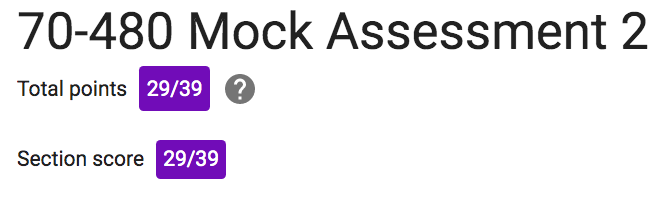

74%

[results](https://docs.google.com/forms/d/e/1FAIpQLSd67ICFd-mSzHr93Z29JNTnTfhxwEVczxleTsF3xv4ukd4oeg/viewscore?viewscore=AE0zAgAx_E40aOWNXVg1Pb7rPLylUWczg5dpBK5X8vZ7wkLOtUObnvijbNyGgqHGjt1Ir-c)

---

### ❌ Q5 - overridden method

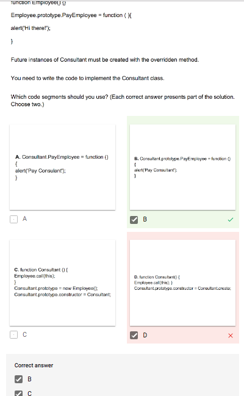

---

### ❌ Q12 - overridden method

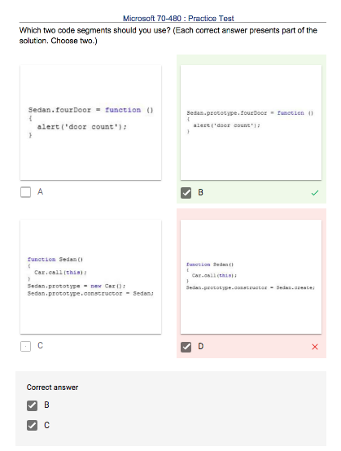

---

### ❌ Q13 - auto vs. min-content

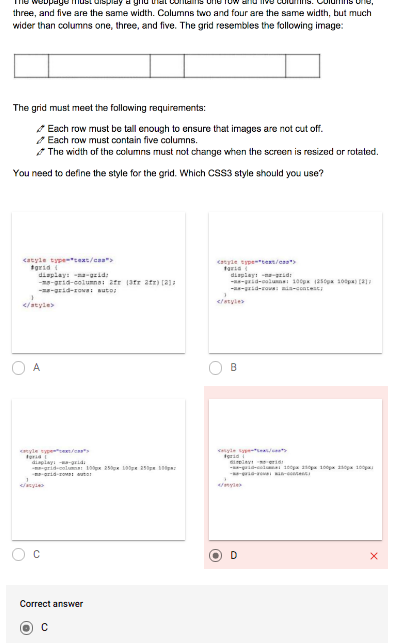

---

### ❌ Q15 - pseudo and not selectors

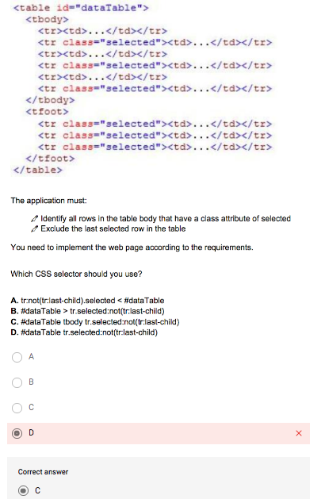

However, this doesn't actually work

`#dataTable tbody tr.selected:not(tr:last-child) {background-color: purple}`
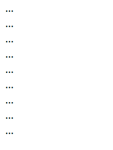

---

### ❌ Q16 - disable form fields

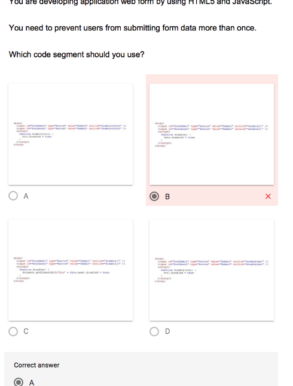

```html
<body>
    <input id="btnSubmit" type="button" value="submit" onclick="disable(this)" />
    <input id="btnCancel" type="button" value="submit" onclick="disable(this)" />
    <script>
    function disable(ctrl) {
        ctrl.disabled = true
    }
    </script>
```

Putting this on down to not being able to read the screenshot properly as I can see this is correct not I look REALLY closely at it

---

### ❌ Q17 - prototype

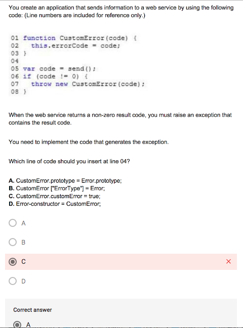

---

### ❌ Q22 - canvas

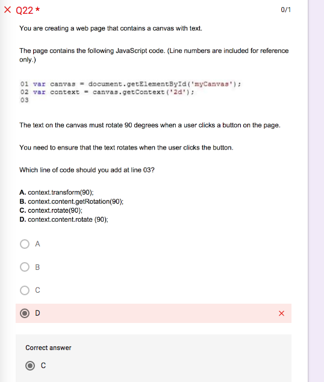

---

### ❌ Q25 - uploading files

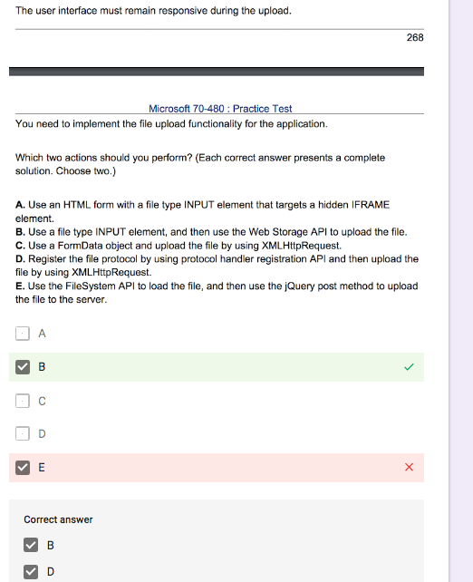

---

### ❌ Q31 - isPrototypeOf

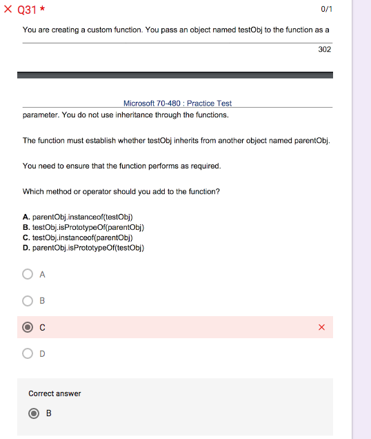

---

### ❌ Q37 - onChange

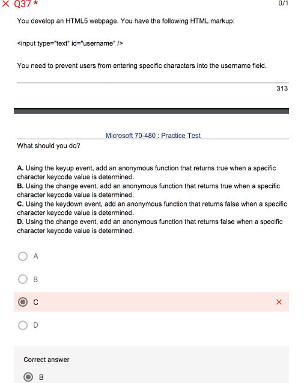

---

## Themes to work on

- inheritance
- overridden method
- canvas
- uploading files
- auto vs min-content
- pseudo and not selectors
