# Assessment 3 Notes <!-- omit in toc -->

[Link](https://docs.google.com/forms/d/e/1FAIpQLSeU219LrKoma-D-s2EgC-AKA8IsBAc1-2yLaz7abiegNX6O-w/viewform)

- [❓](#%e2%9d%93)
- [Results](#results)
  - [:x: Q6 - relative/absolute position](#x-q6---relativeabsolute-position)
  - [:x: Q13 - setting child css specific](#x-q13---setting-child-css-specific)
  - [:x: Q27 - self executing function](#x-q27---self-executing-function)
  - [:x: Q28 - web-workers - missed that needed 2](#x-q28---web-workers---missed-that-needed-2)
  - [:x: Q29 - make button click](#x-q29---make-button-click)
  - [:x: Q30 - border-box](#x-q30---border-box)
- [Themes to work on](#themes-to-work-on)

---

## ❓

<details><summary>Not sure</summary>

- 6 - relative/absolute
- 11 - ms-wrap-flow
- 17 - json parse
- 25 - SVG transform/scale
- 27 - self executing function
- 28 - web workers terminate
- 29 - toggle/trigger
- 30 - border-box
- 34 - flex column/row reverse

</details>

---

## Results

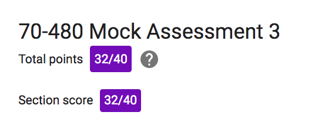

80%

[results](https://docs.google.com/forms/d/e/1FAIpQLSeU219LrKoma-D-s2EgC-AKA8IsBAc1-2yLaz7abiegNX6O-w/viewscore?viewscore=AE0zAgBQGU1whHVG35Sl9uLPKGgCR3yAIfZyWvilmu7ZpbokxGgOAbsGHLBdHXjG8vDyZCI) 

---

### :x: Q6 - relative/absolute position

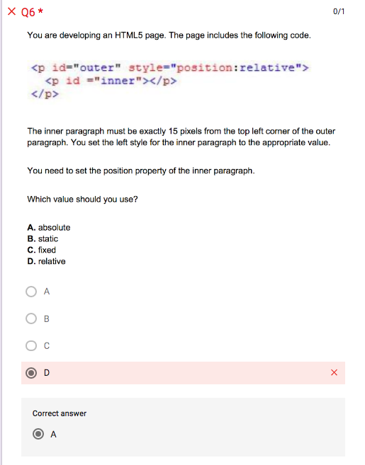

---

### :x: Q13 - setting child css specific

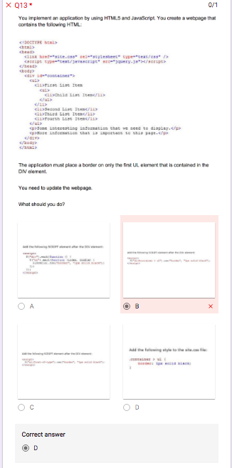

However, this doesn't actually work as it's an id of container and not a class

```css
.container > ul {
  border: 1px solid black;
}
```

If the css was for ID then it would work
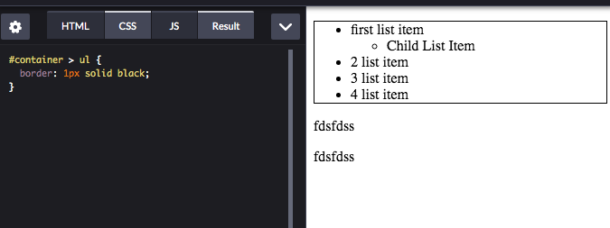

My answer is actually correct

```js
 $("div#container > ul").css("border","1px solid black");
 ```

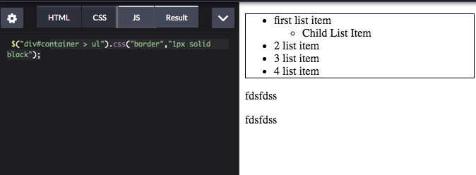

---

### :x: Q14 - media query in main css file

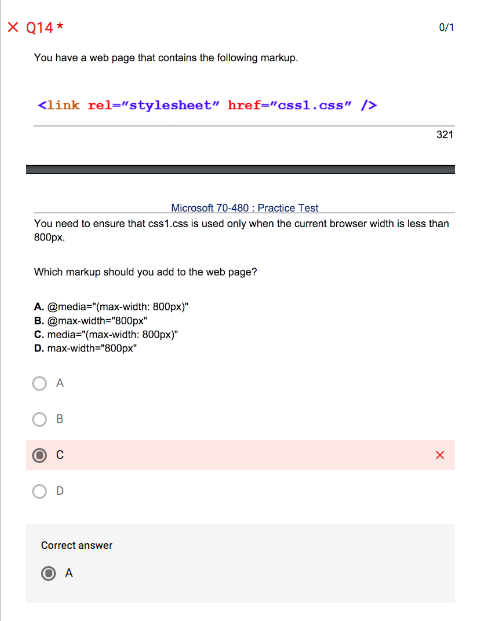

---

### :x: Q25 - svg radius increase - actually none work

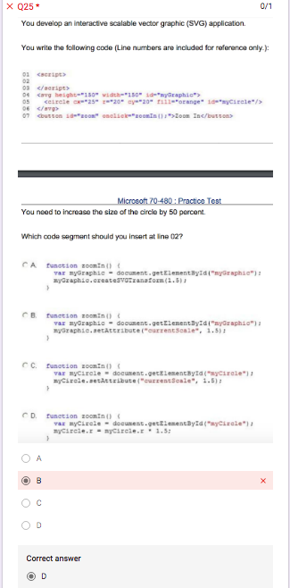

I was wrong but actually none of these work

something like this might work

```js
function zoomIn() {
    
var myCircle = document.getElementById("myCircle");
    
myCircle.r.baseVal.value = myCircle.r.baseVal.value * 1.5;
}
```

or 

```js
function zoomIn() {
    
var myCircle = document.getElementById("myCircle");
    
myCircle.setAttribute("r", 20 * 1.5);
}
```

---

### :x: Q27 - self executing function

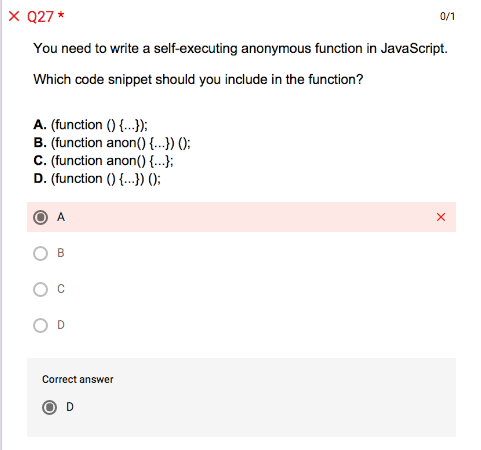

---

### :x: Q28 - web-workers - missed that needed 2

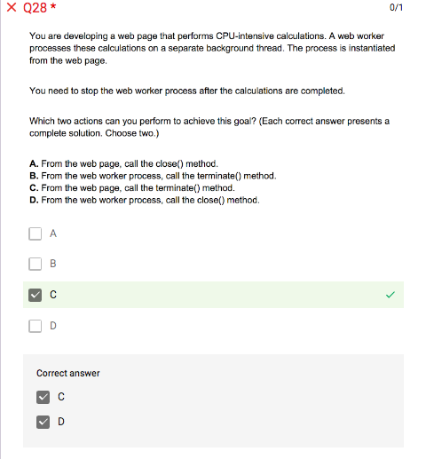

---

### :x: Q29 - make button click

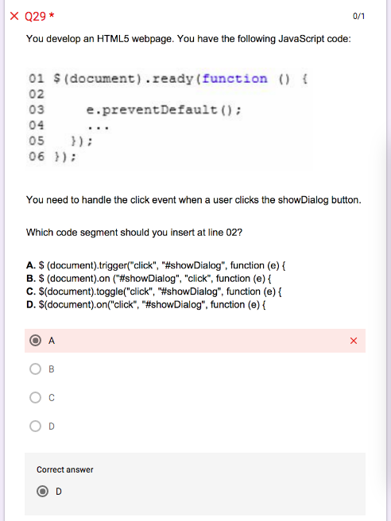

---

### :x: Q30 - border-box

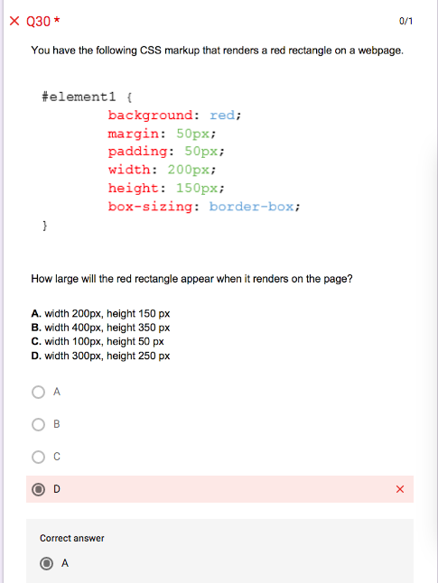

---

## Themes to work on

- web workers
- absolute and relative positions
- border-box
- click in jquery - on click
