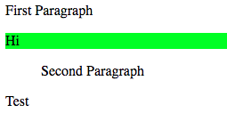

# Microsoft Ignite 2015 Exam Prep Session for Exam 70 480 Programming in HTML5 with JavaScript and CSS <!-- omit in toc -->

[Link to video](https://www.youtube.com/watch?v=1M2LdJDBLwg)
[github](https://github.com/SidneyAndrewsOpsgility/HTML5Demos)

- [Exam Tips](#Exam-Tips)
- [Exam Topics](#Exam-Topics)
  - [Drawing, Style and Animations](#Drawing-Style-and-Animations)
    - [SVG shapes](#SVG-shapes)
      - [Path Commands](#Path-Commands)
    - [Example](#Example)
    - [Transformations](#Transformations)
    - [Transitions](#Transitions)
    - [Canvas](#Canvas)
  - [CSS Selectors](#CSS-Selectors)
    - [Questions](#Questions)
  - [HTML5 Objects](#HTML5-Objects)
    - [Audio/Video](#AudioVideo)
  - [Application cache](#Application-cache)
    - [Updating Application cache](#Updating-Application-cache)
  - [Geolocation](#Geolocation)
  - [More questions](#More-questions)
  - [JavaScript](#JavaScript)
    - [Web worker](#Web-worker)
    - [Creating objects](#Creating-objects)
  - [Remote Communication](#Remote-Communication)
    - [XML HTTP](#XML-HTTP)
    - [Reading JSON](#Reading-JSON)
    - [JQuery](#JQuery)
    - [AJAX call](#AJAX-call)
      - [Demo 1 - jQuery selectors](#Demo-1---jQuery-selectors)
      - [Demo 2 - jQuery Interactive](#Demo-2---jQuery-Interactive)
      - [Demo 3 - jQuery HTTP Get](#Demo-3---jQuery-HTTP-Get)
    - [AJAX](#AJAX)
    - [Web Sockets](#Web-Sockets)
  - [Even more questions](#Even-more-questions)

## Exam Tips

**Exam outline**

- Use CSS3 in Applications (25%)
- Implement programme flow (js) (25%)
- Implement and manipulate document structures and objects (DOM and some jQuery) (25%)
- Access and Secure data (25%)

## Exam Topics

### Drawing, Style and Animations

#### SVG shapes

Using markup to define shapes. and location

Put geometric objects in html markup - absolute position

- Circle
- Ellipse
- Rectangle
- Polyline
- Polygon
- Path

##### Path Commands

Manually define a shape or open path

Command   | Name
---------|----------
 M |      Move to location
 L |      Draw line
 A |      Elliptical arc
 Q |      Quadratic Bezier Curve
 C |      Cubic Bezier curve
 Z |      Close path

 Uppercase is absolute and lowercase is relative

#### Example

```js
 <svg height="140" width="500">
  <ellipse cx="200" cy="80" rx="100" ry="50"
  style="fill:yellow; stroke:purple; stroke-width:2;" />
</svg>

<svg height="400" width="500">
  <rect x="50" y="20" width="150" height="150"
  style="fill:blue; stroke:pink; stroke-width:5;fill-opacity: 0.9;" />
</svg>

<svg height="210" width="500">
    <polygon points="200,10 250,190 160,210"
    style="fill:lime; stroke:purple; stroke-width:1;" />
</svg>

<svg height="400" width="450">
  <path id="lineAB" d="M 100 350 l 150 -300" stroke="blue"
  stroke-width="3" fill="none" />
  <path id="lineBC" d="M 250 50 l 150 300" stroke="red" stroke-width="3" fill="none" />
</svg>

<svg height="210" width="400">
    <path d="M150 0 L75 200 L225 200 Z" stroke="green" stroke-width="5" />
</svg>
```


- Ellipse

  `<ellipse cx="200" cy="80" rx="100" ry="50"`

  - `cx` =  attribute defines the x coordinate of the center of the ellipse
  - `cy` =  attribute defines the y coordinate of the center of the ellipse
  - `rx` =  attribute defines the horizontal radius
  - `ry` =  attribute defines the vertical radius

  CSS styling

- Rectangle

  `<rect x="50" y="20" width="150" height="150"`

  Set an absolute position with `x` and `y` and then a `height` and `width`

  CSS Styling

- Polygon

  `<polygon points="200,10 250,190 160,210"`

  `200,10` is `x,y` point.  Then line to the next point, then next point, then closes automatically and fills

  CSS Styling

- Path

  `<path id="lineAB" d="M 100 350 L 150 -300" stroke="blue" stroke-width="3" fill="none" />`

  **M**ove to 100 350, then draw a **L**ine to 150 -300

  `M` = move
  `L` = line

  e.g. 
  - `M 100,100` means "Pick up the pen and move it to the exact coordinates 100,100"
  - `m 100,100` means "Move the Pen 100 down and 100 right from wherever you currently are."

---

#### Transformations

- Translate - move
- Rotate
- Scale
- Skew

Apply an effect to an element

---

#### Transitions

- `transition-property`
- `transition-duration`
- `transition-timing-function`
- `linear (default)`
  - `ease`
  - `ease-in`
  - `ease-out`
  - `ease-in-out`
  - `cubic-bezier`

---

#### Canvas

```html
<canvas id="canvas" width="200" height="100" style="border:1px solid #000000;"></canvas>
```


```js
var canvas = document.getElementById("canvas");
var context = canvas.getContext("2d");
context.clearRect(0, 0, canvas.width, canvas.height)

context.strokeStyle = "rgb(0, 0, 255)";
context.fillStyle = "rgb(255, 0, 0, 0.75)";

// create a path
context.beginPath();
context.moveTo(20, 20);
context.lineTo(80, 70);
context.stroke();
context.lineTo(40, 110);
context.stroke();
context.closePath();
context.stroke();
context.fill();
```


---

### CSS Selectors

- `>` - Direct descendent
- `+` - Adjacent (after)
- `:after` - Add content after item
- `:required` - Filter to required input items
- and many more

```html
<div>
  <p id="three">First Paragraph</p>
  <div class="hello" lang="en">Hi</div>
    <ul>
      <p id="two">Second Paragraph</p>
    </ul>
    <div id="three">Test</div>
</div>
```

```css
div > p {
  /* p that's a child of a div - direct descendent */
  background-color: yellow;
}
```


```css
div p {
  /* p that's a child of a div - not just direct descendent */
  background-color: yellow;
}
```


```css
ul + div {
  /* div that comes right after a ul */
  background-color: orange;
}
```


```css
div.hello {
  /* div with class of hello */
  background-color: lime;
}
```



```css
div#three {
  /* div with id of three */
  background-color: seagreen;
}
```


```css
#three {
  /* anything with id of three */
  background-color: seagreen;
}
```


```css
div[lang=en]{
  /* div with attribute of lang-en */
  background-color: red;
} 
```


---

#### Questions


Answer - c: `nav a`


Answer - a + b


Answer - b: `input:required { background-color: yellow;`

---

### HTML5 Objects

#### Audio/Video

Video

```html
<video width="320" height="240" poster="logo.jpg"
controls autobuffer autoplay loop mute>
  <source src="movie.mp4" type="video/mp4">
  <source src="movie.ogg" type="video/ogg">
Your browser does not support the video tag.
</video>
```

Audio

```html
<audio controls>
  <source src="horse.ogg" type="audio/ogg">
  <source src="horse.mp3" type="audio/mpeg">
Your browser does not support the audio element.
</audio>
```

---

### Application cache

Caching certain files and what files to fallback to

```
CACHE MANIFEST
#VERSION 1.0

CACHE:
/index.html/styles/site.css
/images/logo.jpg

NETWORK:
/members

FALLBACK:
/details/ /offline.html
```

---

#### Updating Application cache

Swap cache and download new files

```js
//download new application cache
applicationCache.Update();

// wait for the data to be downloaded, then swap cache
if (aplicationCache.status == 4) {
  applicationCache.swapCache();
}
```

---

### Geolocation

Being able to use the client/browser geolocation

Methods, options and return data


---

### More questions


Answer - b: sessionStorage

localStorage persists across tabs

sessionStorage only in same tab

Think of browser as a browser session


Answer - a + d

---

### JavaScript

#### Web worker

When executing scripts in an HTML page, the page becomes unresponsive until the script is finished.

A web worker is a JavaScript that runs in the background, independently of other scripts, without affecting the performance of the page. You can continue to do whatever you want: clicking, selecting things, etc., while the web worker runs in the background.

Allow you to run asynchronous processes in the background.  Offload things to another thread

Have a script file - what the worker does asynchronously.

Create a callback that handles the message

```js
var worker = new Worker("/scripts/worker.js"); 
  
worker.onmessage = function (event) {
  
  console.log(event.data);
  
  var newItem = $('<li>', {
    html: event.data,
    'class': 'list-group-item'
  });
  
  $("#messageList").append(newItem);
  
};

// postMessage sends signals to the web worker
// Web worker starts automatically, so if you want to delay execution
// you need to provide that mechanism
worker.postMessage("START");
  
$("#send").click(function () {
  
    worker.postMessage($("#message").val());
  });
  
// var worker = new Worker("/Scripts/Worker.js");

// worker.onmessage = function (event) {
//   $("#messageList").append("<li>" + event.data + "</li>");
// };


// worker.postMessage("START");

// $("#send").click(function () {
//   worker.postMessage($("#message").val());
// });
```

In this example, any time the worker responds we append an `<li>` to the `#messageList`

The worker.js

```js
var started = false
self.onmessage = function (event) {
  if (event.data == "START") {
    startWork();
  } else {
    sendMessage(event.data);
  }
}

// postMessage sends signals to the caller
function startWork() {
  started = true
  self.postMessage("Worker started.");
}

function sendMessage(message) {
  if (started) {
    self.postMessage('[Processed]: ' + message);
  }
}
```

Has a callback when it receives a message

if message received "START" then proceeds and sends message saying started.  Otherwise will echo the received message back

---

#### Creating objects

object oriented.  Sort of class

```js
"use strict"
var Student = function (name) {
  var name = name
  var getName = function () {
    return name;
  };
  return {
    get_name: getName
  }
}

var student = new Student("Christopher");
alert(student.get_name());
```

---

### Remote Communication

#### XML HTTP

```js
var request = new XMLHttpRequest();
request.open("GET", "/products/list", true);
request.onreadystatechange = function () {
  if (request.readyState === 4) {
    var response = JSON.parse(request.responseText);
    var productList = response.productList;
    displayList();
  }
};
request.send();
```

`request.open`

Followed by callback on `request.onreadystatechange`

---

#### Reading JSON

Once you get results back

```js
function displayLocations(result) {
  for (var i = 0; i < result.d.length; i++) {
    var product = result.d(i);
    var item = "<li>" + product.Name + "</li>"
    $("#products-list").append(item);
  }
}
```

#### JQuery


Selectors in JQuery correlate to CSS3 selectors

---

#### AJAX call

##### Demo 1 - jQuery selectors

Common HTML for Demo 1(appears after the jQuery in the code)

```html
<h3>jQuery Selector</h3>
<button id="buttonone" class="stylealpha">Style Me</button>
<button id="buttontwo" class="stylebeta">Style Me Too</button>
```

---

```js
<script type="text/javascript">
$(document).ready(function () {
  
  $('button').css('background', '#65a9d7').css('margin', '25px');
  
});
</script>
```

`$('button').css('background', '#65a9d7').css('margin', '25px');`

Anything that's a button, apply this css, background and margin


---

```js
<script type="text/javascript">
$(document).ready(function () {
  
  $('button').css('background', '#65a9d7').css('margin', '25px');
  
  $('button#buttonone').css('font-weight', 'bold');
  
});
</script>
```

`$('button#buttonone').css('font-weight', 'bold');`

A button with the ID of `buttonone` set the font weight to bold


---

```js
<script type="text/javascript">
$(document).ready(function () {
  
  $('button').css('background', '#65a9d7').css('margin', '25px');
  
  $('button#buttonone').css('font-weight', 'bold');

  $('.stylebeta').css('border', '3px solid #96d1f8');
  
});
</script>
```

`$('.stylebeta').css('border', '3px solid #96d1f8');`

Anything with the class of `stylebeta` set border


---

```js
<script type="text/javascript">
$(document).ready(function () {
  
  $('button').css('background', '#65a9d7').css('margin', '25px');
  
  $('button#buttonone').css('font-weight', 'bold');

  $('.stylebeta').css('border', '3px solid #96d1f8');
  
  $('#buttontwo').css('font-family','Georgia');
  
  
});
</script>
```

`$('#buttontwo').css('font-family','Georgia');`

ID of `buttontwo` set the font to Georgia


---

```js
<script type="text/javascript">
$(document).ready(function () {
  
  $('button').css('background', '#65a9d7').css('margin', '25px');
  
  $('button#buttonone').css('font-weight', 'bold');

  $('.stylebeta').css('border', '3px solid #96d1f8');
  
  $('#buttontwo').css('font-family','Georgia');
  
  $('button.stylealpha').css('border-radius','5px');
  
});
</script>
```

`$('button.stylealpha').css('border-radius','5px');`

Any button with the class of `stylealpha` set the border radius


---

##### Demo 2 - jQuery Interactive

<!-- Common HTML for Demo 2 (appears after the jQuery in the code) -->

<!-- 

--- -->

```js
<script type="text/javascript">
$(document).ready(function () {
  
  $('button#buttonfour').hide();

  $('button#buttonthree').click(function () {
  
    $(this).hide();	
    $('button#buttonfour').show();

  });
});
</script>
```

```html
<h3>jQuery Interactive</h3>
<button id="buttonthree">Click Me</button>
<button id="buttonfour">Hi There!</button>
```

When the DOM is ready,

- `$('button#buttonfour').hide();` hide the button with the ID of `buttonfour`
- `$('button#buttonthree').click` add a click handler to the button with the ID of `buttonthree` which has a callback function that ...
- `$(this).hide();` hides itself (`buttonthree`)
- `$('button#buttonfour').show();` beings back the button with the ID of `buttonfour`


Click the button


---

##### Demo 3 - jQuery HTTP Get

```js
<script type="text/javascript">
$(document).ready(function () {

// add a click handler to the button with sendvote ID
  $('button#sendvote').click(function () {
// get the values from the elements with IDs of name and color and put in variables
    var nameInput = $('#name').val();
    var colorInput = $('#color').val();
  
// post to the api path api/data a JSON object with the name and color that uses your variables
    $.post('api/data', { name: nameInput, color: colorInput })
    //when done, callback function which takes the data and puts it as html into the paragraph with the ID of voteresult
      .done(function (data) {

        $('p#voteresult').html(data);

      });

  });

});
</script>
```

```html
<h3>jQuery HTTP Get</h3>
<div class="well">
<form class="form-horizontal">
  <fieldset>
    <legend>Vote on a Color</legend>
    <div class="form-group">
      <label class="col-lg-2 control-label" for="name">Name</label>
      <div class="col-lg-10">
        <input class="form-control" id="name" type="text" placeholder="Name">
      </div>
    </div>
    <div class="form-group">
      <label class="col-lg-2 control-label" for="color">Color</label>
      <div class="col-lg-10">
        <input class="form-control" id="color" type="text" placeholder="Color">
      </div>
    </div>
    <div class="form-group">
      <div class="col-lg-10 col-lg-offset-2">
        <button class="btn btn-primary" id="sendvote" type="submit">Send Vote</button>
      </div>
    </div>
    <div class="form-group">
      <label class="col-lg-2 control-label">Result</label>
      <div class="col-lg-10">
        <p id="voteresult"></p>
      </div>
    </div>
  </fieldset>
  </form>
  </div>
```

Important to know the order of the post request

` $.post('api/data', { name: nameInput, color: colorInput })`

` $.post(<api endpoint>, <JSON object>)`

Then add a `.done`


<details><summary>For reference - api details</summary>

```js
app.post('/api/data', function(req, res) {
  
  var isValid = false;
  if (req.body) {
  if (req.body.hasOwnProperty('name') && req.body.hasOwnProperty('color')) {
    isValid = true;   
  }  
  }
  
  if (!isValid) {
    return res.status(400).send('Post syntax incorrect.  Must have a name and color property.');
  } 
  else {
    var response = req.body.name + ' chose the color ' + req.body.color + '.';
    console.log(response);  
    return res.status(201).send(response)
  }
  
});
```

</details>

---

#### AJAX

```js
var productJSON = JSON.stringify({ newProduct: product });
$.ajax({
  url: "/Services/ProductService.svc/Add",
  type: "POST",
  dataType: "json",
  contentType: "application/json; charset=utf-8",
  data: productJSON,
  success: displayLocations,
  failure: displayError
})
```

in jQuery, the post, get, put and delete is essentially doing an AJAX call.  You can get more detailed into the parameters using this syntax however.

---

#### Web Sockets

Asynchronous way to send communication back and forth in a connected channel.  Communicate from web application to server and vice versa.  Doesn't need a http request.  Useful for chat

```js
if (window.WebSocket){
  var socket = new WebSocket('wss://url.com/endpoint');
  socket.onopen = function () {
    socket.send('hello, world');
  }
  socket.onmessage = function (event) {
    if (event.type == 'Text') {
      $('#output').text(event.data);
    }
  }
}
```

- create new websocket
- specify endpoint
- when open give it a callback
- when receive message another callback

---

### Even more questions


Answer - c: update line 4 to `function updatePage() { $("#output").text("Hello, world!");}`

---
