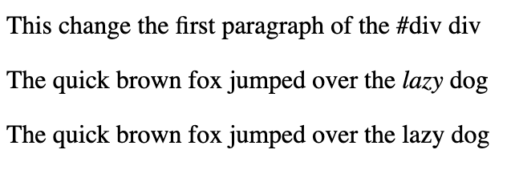
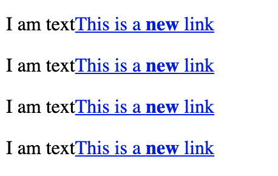

# Introduction to jQuery <!-- omit in toc -->

[Link to video](https://channel9.msdn.com/Series/Introduction-to-jQuery)

- [Getting started](#Getting-started)
  - [Document Ready](#Document-Ready)
- [Selectors](#Selectors)
  - [Syntax](#Syntax)
  - [Multiple selectors](#Multiple-selectors)
  - [Basic selectors](#Basic-selectors)
  - [Attribute selectors](#Attribute-selectors)
  - [Hierarchy selectors](#Hierarchy-selectors)
  - [Positional selectors](#Positional-selectors)
  - [Filters - different kind of selector](#Filters---different-kind-of-selector)
  - [Chaining](#Chaining)
- [Manipulating the DOM](#Manipulating-the-DOM)
  - [Element manipulation](#Element-manipulation)
    - [Inside elements](#Inside-elements)
    - [Copying elements](#Copying-elements)
    - [Create new elements](#Create-new-elements)
    - [Removing elements](#Removing-elements)
    - [Replacing elements](#Replacing-elements)
    - [Wrapping elements](#Wrapping-elements)
  - [Modifying attributes](#Modifying-attributes)
    - [Styling elements](#Styling-elements)
  - [Styling and dimensions](#Styling-and-dimensions)

---

## Getting started

Import the jQuery library via CDN or script

### Document Ready

Using document ready means you don't have to worry that things have loaded or not - it will only happen when it's ready.  Also not worrying about browser differences.

Several ways of doing this

The shortest

```js
$(function(){
  // run this when ready
});
```

Another way

```js
$(document).ready(function(){
  // run this when ready
})
```

---

## Selectors

jQuery selectors derived from CSS selectors

Selectors for:

- Elements, by ID, attribute, name, etc
- Attribute
- Form elements
- Hierarchy (parent, child, descendent, sibling)
- Elements by state (enabled, disabled, hidden, selected)
- Position
- Class

Specificity - select things with precision

### Syntax

```js
$("selector");
$("selector").method();
```

### Multiple selectors

```js
// comma separated selectors
$("selector1, selector2, selector N");

// 
$("element[attr='value'][attr='value2']");
```

**Wrapped sets**

If selected a group of elements can get at them individually

```js
$("selector")[0];
$("selector").get(0);
```

Adds to wrapped set but not DOM.  Work with things 'off to the side' before putting back into DOM

```js
$("selector").add("<div>Added content</div>");
```

---

### Basic selectors

```js
$("*") // selecting everything
$("elementName") // tagname (p, a, div, etc)
$("#elemendId") // ID - should only ever be 1
$(".class") // class
```

---

### Attribute selectors

```js
$("selector[attr]"); // that has an attribute - required for example
$("selector[attr='value']"); // attribute equalling a value
$("selector[attr^'value']"); // attribute begins with
$("selector[attr$'value']"); // attribute ends with
$("selector[attr*'value']"); // attribute contains
```

---

### Hierarchy selectors

```js
$("ancestor descendant")
$("parent elem > child elem")
$("prev elem + next elem")
$("prev sibling - next sibling")
```

---

### Positional selectors

```js
$("element:first";)
$("element:last";)
```

### Filters - different kind of selector

```js
$(":button");
$(":checkbox");
$(":password");
$(":submit");
$(":text");
$(":file");

$(":contains(text)");
$(":not(selector)");
```

---

### Chaining

Allows you to run multiple commands on a wrapped set while only accessing those DOM elements once

```js
$("selector").method();
$("selector").method().method2();
```

```js
$("p").css("background-color","red").css("color","green");
```

---

## Manipulating the DOM

### Element manipulation

```html
<div id="div">
  <p>text text text</p>
  <p id="p">I am some text</p>
  <p id="notp">I am some text</p>
</div
```

```js
// methods
$("#p").html("The quick brown fox jumped over the <em>lazy</em> dog");
$("#notp").text("The quick brown fox jumped over the lazy dog");
$("#div p:first").text("This change the first paragraph of the #div div");
```



---

#### Inside elements

```js
$("content").appendTo("selector"); // take content and append to the selector
$("content").prependTo("selector"); // take content and prepend to the selector

$("selector").appendTo("<li>this is after</li>"); //start with selector, then add the content
$("selector").prependTo("<li>this is after</li>");

// both types do the same
```

---

#### Outside elements

```js
$("content").insertAfter("selector"); // insert after the selector
$("content").insertBefore("selector"); // insert before the selector

$("selector").after("<li>this is after</li>"); // insert after the selector
$("selector").before("<li>this is after</li>"); // insert before the selector

$(selector).before(content, function(index) {}); // take selector, call before or after, tell it to run function to get it done

```

---

#### Copying elements

```js
$("selector").clone().appendTo("selector2"); // clone selector, then append to another selector
```

---

#### Create new elements

```js
$("<a/>", {
  html: "This is a <strong>new</strong> link",
  "class":"link",
  href: "page.html"
}).appendTo("p");
```

```html
<p>I am text</p>
```

Choose selector, the set the attributes

Creates an element but doesn't attach to the DOM so need to add append or similar


In this example, multiple `<p>` tags will get the link added to it



---

#### Removing elements

```js
$("selector").remove(); // just get removed
$("selector").detach(); // can detach and make changes and then add back to the DOM - performant
$("selector").empty(); // empties from the DOM
```

---

#### Replacing elements

```js
$("selector").replaceAll("content");
$("selector").replaceWith("content");
```

#### Wrapping elements

```js
$("selector").wrap();
$("selector").wrapAll();
$("selector").wrapInner();
$("selector").unwrap();
```

---

### Modifying attributes

```js
$("selector").attr("name", "value"); // name of attribute and the value to change it to
$("selector").prop("name", "value"); // name of property and the value to change it to
$("selector").removeAttr("name"); // remove attribute
$("selector").removeProp("prop"); // remove prop
$("selector").attr("name", function(attr){ ... });
```

---

#### Styling elements

Inline styling

```js
$("selector").css("style","value"); // $("p").css("background-color","red");
$("selector").css({"style":"value","style":"value"}); //JSON like - for multiple styles
$("selector").css("style", function(index, value) { ... });
```

---

### Styling and dimensions

Adding classes to a selector.  Better as not inline styling

**Classes**

```js
$("selector").hasClass("className"); // does selector have class already
$("selector").addClass("className");
$("selector").addClass("className className2");
$("selector").addClass("className2").removeClass("className");
$("selector").removeClass("className");
$("selector").removeClass("className");
$("selector").toggleClass("className className2");
```

**Dimensions**

```js
$("selector").width("100px");
$("selector").width();
$("selector").height("100px");
$("selector").height();
$("selector").position();
```

---
