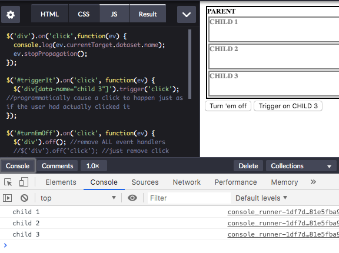
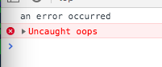
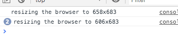
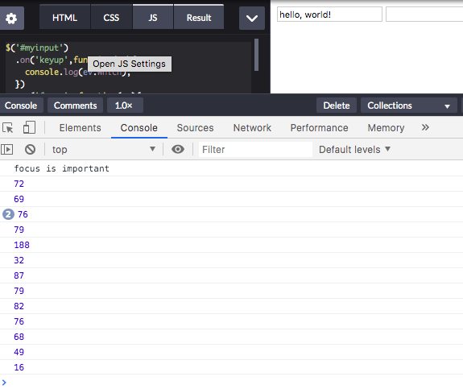
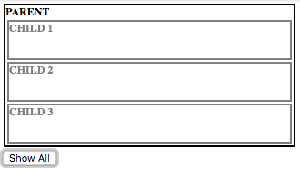
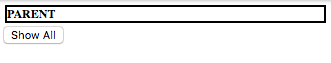
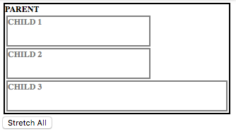

# Introduction to jQuery <!-- omit in toc -->

[Link to videos](https://channel9.msdn.com/Series/Introduction-to-jQuery)

- [**Getting started**](#Getting-started)
  - [Document Ready](#Document-Ready)
- [**Selection**](#Selection)
  - [Syntax](#Syntax)
  - [Multiple selectors](#Multiple-selectors)
  - [Basic selectors](#Basic-selectors)
  - [Attribute selectors](#Attribute-selectors)
  - [Hierarchy selectors](#Hierarchy-selectors)
  - [Positional selectors](#Positional-selectors)
  - [Filters - different kind of selector](#Filters---different-kind-of-selector)
  - [Chaining](#Chaining)
- [**Manipulating the DOM**](#Manipulating-the-DOM)
  - [Element manipulation](#Element-manipulation)
    - [Inside elements](#Inside-elements)
    - [Copying elements](#Copying-elements)
    - [Create new elements](#Create-new-elements)
    - [Removing elements](#Removing-elements)
    - [Replacing elements](#Replacing-elements)
    - [Wrapping elements](#Wrapping-elements)
  - [Modifying attributes](#Modifying-attributes)
    - [Styling elements](#Styling-elements)
  - [Styling and dimensions](#Styling-and-dimensions)
- [**Events**](#Events)
  - [Attachment and the Event object](#Attachment-and-the-Event-object)
    - [Attaching to events](#Attaching-to-events)
    - [Event object](#Event-object)
  - [Browser events](#Browser-events)
  - [Document loading events](#Document-loading-events)
  - [Form events](#Form-events)
  - [Keyboard events](#Keyboard-events)
  - [Mouse events](#Mouse-events)
- [**Effects**](#Effects)
  - [Basic effects](#Basic-effects)
  - [Fading](#Fading)
  - [Sliding](#Sliding)
  - [Custom effects](#Custom-effects)
- [**Ajax and Async**](#Ajax-and-Async)
- [**Libraries**](#Libraries)

---

## **Getting started**

Import the jQuery library via CDN or script

### Document Ready

Using document ready means you don't have to worry that things have loaded or not - it will only happen when it's ready.  Also not worrying about browser differences.

Several ways of doing this

The shortest

```js
$(function(){
  // run this when ready
});
```

Another way

```js
$(document).ready(function(){
  // run this when ready
})
```

---

## **Selection**

jQuery selectors derived from CSS selectors

Selectors for:

- Elements, by ID, attribute, name, etc
- Attribute
- Form elements
- Hierarchy (parent, child, descendent, sibling)
- Elements by state (enabled, disabled, hidden, selected)
- Position
- Class

Specificity - select things with precision

### Syntax

```js
$("selector");
$("selector").method();
```

### Multiple selectors

```js
// comma separated selectors
$("selector1, selector2, selector N");

// 
$("element[attr='value'][attr='value2']");
```

**Wrapped sets**

If selected a group of elements can get at them individually

```js
$("selector")[0];
$("selector").get(0);
```

Adds to wrapped set but not DOM.  Work with things 'off to the side' before putting back into DOM

```js
$("selector").add("<div>Added content</div>");
```

---

### Basic selectors

```js
$("*") // selecting everything
$("elementName") // tagname (p, a, div, etc)
$("#elemendId") // ID - should only ever be 1
$(".class") // class
```

---

### Attribute selectors

```js
$("selector[attr]"); // that has an attribute - required for example
$("selector[attr='value']"); // attribute equalling a value
$("selector[attr^'value']"); // attribute begins with
$("selector[attr$'value']"); // attribute ends with
$("selector[attr*'value']"); // attribute contains
```

---

### Hierarchy selectors

```js
$("ancestor descendant")
$("parent elem > child elem")
$("prev elem + next elem")
$("prev sibling - next sibling")
```

---

### Positional selectors

```js
$("element:first";)
$("element:last";)
```

### Filters - different kind of selector

```js
$(":button");
$(":checkbox");
$(":password");
$(":submit");
$(":text");
$(":file");

$(":contains(text)");
$(":not(selector)");
```

---

### Chaining

Allows you to run multiple commands on a wrapped set while only accessing those DOM elements once

```js
$("selector").method();
$("selector").method().method2();
```

```js
$("p").css("background-color","red").css("color","green");
```

---

## **Manipulating the DOM**

### Element manipulation

```html
<div id="div">
  <p>text text text</p>
  <p id="p">I am some text</p>
  <p id="notp">I am some text</p>
</div
```

```js
// methods
$("#p").html("The quick brown fox jumped over the <em>lazy</em> dog");
$("#notp").text("The quick brown fox jumped over the lazy dog");
$("#div p:first").text("This change the first paragraph of the #div div");
```


---

#### Inside elements

```js
$("content").appendTo("selector"); // take content and append to the selector
$("content").prependTo("selector"); // take content and prepend to the selector

$("selector").appendTo("<li>this is after</li>"); //start with selector, then add the content
$("selector").prependTo("<li>this is after</li>");

// both types do the same
```

---

#### Outside elements

```js
$("content").insertAfter("selector"); // insert after the selector
$("content").insertBefore("selector"); // insert before the selector

$("selector").after("<li>this is after</li>"); // insert after the selector
$("selector").before("<li>this is after</li>"); // insert before the selector

$(selector).before(content, function(index) {}); // take selector, call before or after, tell it to run function to get it done

```

---

#### Copying elements

```js
$("selector").clone().appendTo("selector2"); // clone selector, then append to another selector
```

---

#### Create new elements

```js
$("<a/>", {
  html: "This is a <strong>new</strong> link",
  "class":"link",
  href: "page.html"
}).appendTo("p");
```

```html
<p>I am text</p>
```

Choose selector, the set the attributes

Creates an element but doesn't attach to the DOM so need to add append or similar


In this example, multiple `<p>` tags will get the link added to it


---

#### Removing elements

```js
$("selector").remove(); // just get removed
$("selector").detach(); // can detach and make changes and then add back to the DOM - performant
$("selector").empty(); // empties from the DOM
```

---

#### Replacing elements

```js
$("selector").replaceAll("content");
$("selector").replaceWith("content");
```

#### Wrapping elements

```js
$("selector").wrap();
$("selector").wrapAll();
$("selector").wrapInner();
$("selector").unwrap();
```

---

### Modifying attributes

```js
$("selector").attr("name", "value"); // name of attribute and the value to change it to
$("selector").prop("name", "value"); // name of property and the value to change it to
$("selector").removeAttr("name"); // remove attribute
$("selector").removeProp("prop"); // remove prop
$("selector").attr("name", function(attr){ ... });
```

---

#### Styling elements

Inline styling

```js
$("selector").css("style","value"); // $("p").css("background-color","red");
$("selector").css({"style":"value","style":"value"}); //JSON like - for multiple styles
$("selector").css("style", function(index, value) { ... });
```

---

### Styling and dimensions

Adding classes to a selector.  Better as not inline styling

**Classes**

```js
$("selector").hasClass("className"); // does selector have class already
$("selector").addClass("className");
$("selector").addClass("className className2");
$("selector").addClass("className2").removeClass("className");
$("selector").removeClass("className");
$("selector").removeClass("className");
$("selector").toggleClass("className className2");
```

**Dimensions**

```js
$("selector").width("100px");
$("selector").width();
$("selector").height("100px");
$("selector").height();
$("selector").position();
```

---

## **Events**

### Attachment and the Event object

#### Attaching to events

- `.on()` and `.off()` - most important/popular - replaces the next 4.  Turn on or off event handler
- `.bind()` and `.unbind()` - tie up an event, bind a function to an event
- `.delegate()` and `.undelegated()`
- `.one()`
- `.live()` and `.die()` - kind of document ready but at window level
- `.trigger()` and `.triggerHandler()` - 'remotely' trigger another event

```html
<style>
div { margin: 2px; font:bold 9pt 'Segoe UI';}
.parent {
  border:solid 2px black;
  color:black;
}
.child {
  border:solid 2px gray;
  height:40px;
  color:gray;
}
</style>
<div class="parent" data-name="parent">
  PARENT
  <div class="child" data-name="child 1">CHILD 1</div>
  <div class="child" data-name="child 2">CHILD 2</div>
  <div class="child" data-name="child 3">CHILD 3</div>
</div>
<button id="turnEmOff">Turn 'em off</button>
<button id="triggerIt">Trigger on CHILD 3</button>
```

```js
// select all divs > use the on method to add a click event, then the handler function
$('div').on('click',function(ev) {

    // currentTarget = DOM object clicked on
    // dataset = all the data- tags
    // name - from data-name="child 1"
  console.log(ev.currentTarget.dataset.name);

  // only handle 1 time - won't also log the parent
  // clicking on child 3 is also like clicking on the parent div
  ev.stopPropagation();
});

$('#triggerIt').on('click', function(ev) {
  $('div[data-name="child 3"]').trigger('click'); //programmatically cause a click to happen just as if the user had actually clicked it
});

$('#turnEmOff').on('click', function(ev) {
  $('div').off(); // remove ALL event handlers
  // $('div').off('click'); // just remove click handlers
});
```



---

#### Event object

`ev` in the above examples

- Holds all of the event properties
- Helpful properties include…
  - `.currentTarget` - which element are we talking about right now
  - `.type` - type of event (e.g. click)
  - `.which` - if pressing a key or clicking a button, which one was used.
  - `.timestamp` - exactly when clicked on (ms since 1970)
  - `.target` 
  - `.data` - can pass in data that might be useful

---

### Browser events

- `.error()` - Called if an element is not loaded correctly
- `.resize()` - When the size of the browser window changes
- `.scroll()` - When the user scrolls to a different place in an element or page

```html
<style>
#scroller {
  width:200px;
  height:400px;
  border:solid 1px gray;
  overflow-y:scroll;
}
</style>
<button id="throw">Throw an error</button>
<div id="scroller">
  <p>Lorem ipsum dolor sit amet, consectetur adipiscing elit, sed do eiusmod tempor incididunt ut labore et dolore magna aliqua. Massa vitae tortor condimentum lacinia quis vel eros donec.</p>

<p>Semper risus in hendrerit gravida rutrum. Non arcu risus quis varius quam erdiet. Diam maecenas sed enim ut sem. Turpis tincidunt id aliquet risus feugiat in ante.</p>

<p>Id donec ultrices tincidunt arcu. Integer eget aliquet nibh praesent tristique magna sit. Habitant morbi tristique senectus et netus et adipiscing diam donec adipiscing tristique. Molestie at elementum eu.</p>

<p>Nibh venenatis cras sed felis eget velit aliquet. Non consectetur a erat nam at lectus. Tortor dignissim convallis aenean et tortor at risus. Tempus elementum pulvinar etiam non quam. Eu augue ut lectus arcu bibendum.</p>
</div>
```

```js

$('#scroller').on('scroll', function(ev) {
  console.log('scrolling the scroller div');
});

$(window)
  .on('scroll', function(ev) {
    console.log('scrolling the page');
  })
  .on('resize', function(ev) {
    console.log('resizing the browser to ' + window.outerWidth + 'x' + window.outerHeight);
  })
  .on('error', function(ev) {
    console.log('an error occurred');
  });

$('#throw').on('click', function(ev) {
  throw "oops";  
});

```

scrolling the browser window and the internal div


Click the throw error button



Resizing the browser



---

### Document loading events

- `.load()` - When an element is being loaded
- `.ready()` - When the DOM is loaded and ready (minus content like images).  Use `$(function)` as a shortcut
- `.unload()` - Opposite of load, when an element is being unloaded

---

### Form events

- `.change()` - When an element's value changes (triggered on blur)
- `.focus()` - When an element receives focus
- `.blur()` - When an element loses focus
- `.focusin()` - When an element or any nested elements receives focus
- `.focusout()` - When an element loses focus
- `.select()` - When the user makes a text selection inside
- `.submit()` - When the user is attempting to submit a form

```html
<input type="text" id="myinput"/>
<input type="text" id="myinput2"/>
```

```js
$('#myinput')
  .on('keyup',function(ev){
    console.log(ev.which);
  })
  .on('focus', function(ev){
    console.log('focus is important');
  });
```



---

### Keyboard events

- `.keydown()` - When a key is pressed down
- `.keypress()` - When the browser registers keyboard input (may vary by browser!)Not triggered by Shift, Esc, delete, etc.
- `.keyup()` - When a key returns to the up position

see previous code example

---

### Mouse events

- `.click()`
- `.dblclick()`
- `.hover()`
- `.mousedown()`
- `.mouseenter()`
- `.mouseleave()`
- `.mousemove()`
- `.mouseout()`
- `.mouseover()`
- `.mouseup()`

---

## **Effects**

Animations

### Basic effects

- `.hide()`
- `.show()`
- `.toggle()` - If it's showing, hide it. If it's hiding, show it.

```html
<style>
    div { margin: 2px; font:bold 9pt 'Segoe UI';}
.parent {
  border:solid 2px black;
  color:black;
}
.child {
  border:solid 2px gray;
  height:40px;
  color:gray;
}
</style>
<div class="parent" data-name="parent">
  PARENT
  <div class="child" data-name="child 1">CHILD 1</div>
  <div class="child" data-name="child 2">CHILD 2</div>
  <div class="child" data-name="child 3">CHILD 3</div>
</div>
<button id="showAll">Show All</button>
```

```js
$('.parent div').on('click',function(ev) {
  $(ev.currentTarget).hide();
});

$('#showAll').on('click', function(ev) {
  $('.parent div').show();
});
```



click in the child divs



---

### Fading

Fading adjusts the opacity of the selected element

- `.fadeIn()`
- `.fadeOut()` - fades down to 0 - then set display: none and pulls out of DOM
- `.fadeTo()` - Set the opacity to a set value
- `.fadeToggle()` - If it's showing, fade it out. If it's hidden, fade it in.

(using the html from above)

```js
$('.parent div').on('click',function(ev) {
  $(ev.currentTarget).fadeTo(500,0);
});

$('#showAll').on('click', function(ev) {
  $('.parent div').fadeTo(0,1);
});
```

---

### Sliding

- `.slideUp()` - Hides an element using a sliding motion
- `.slideDown()` - Shows an element using a sliding motion
- `.slideToggle()` - If it's showing, then hide it. If it's hiding, then show it.

```js
$('.parent div').on('click',function(ev) {
  $(ev.currentTarget).slideUp();
});

$('#showAll').on('click', function(ev) {
  $('.parent div').slideDown();
});
```

---

### Custom effects

- `.animate()` - Perform a custom animation of a set of CSS properties
- `.queue()`, `.dequeue()`, and `.clearQueue()` - Control the queue of functions to be executed on the matched elements
- `.delay()` - Set a timer to delay execution of subsequent items in the queue
- `.stop()` - Stop the animation
- `.finish()` - Stop the animation and clear queue

```html
<style>
    div { margin: 2px; font:bold 9pt 'Segoe UI';}
.parent {
  border:solid 2px black;
  color:black;
}
.child {
  border:solid 2px gray;
  height:40px;
  color:gray;
}
</style>
<div class="parent" data-name="parent">
  PARENT
  <div class="child" data-name="child 1">CHILD 1</div>
  <div class="child" data-name="child 2">CHILD 2</div>
  <div class="child" data-name="child 3">CHILD 3</div>
</div>
<button id="stretchAll">Stretch All</button>
```


```js
// $.easing.easeInOutQuad = function (x, t, b, c, d) {
//     if ((t/=d/2) < 1) return c/2*t*t + b;
//     return -c/2 * ((--t)*(t-2) - 1) + b;
// }

// $('.parent div').on('click',function(ev) {
//   $(ev.currentTarget).animate({width:200},'slow', 'easeInOutQuad');
// });

$('.parent div').on('click',function(ev) {
  $(ev.currentTarget).animate({width:200},{duration:500});
});

$('#stretchAll').on('click', function(ev) {
  $('.parent div').css('width','auto');
});
```

Click child 1 and 2



---

## **Ajax and Async**


---

## **Libraries**


---
