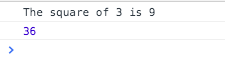

# Javascript for Experienced Developers <!-- omit in toc -->

<!-- - [Link to video](https://www.youtube.com/watch?v=5Rcjl-kEaNc)
- [another link](https://www.youtube.com/watch?v=3Xdyj32SqzQ) -->
- [Link to videos](https://www.youtube.com/playlist?list=PLIoX3-mcY80jWF8tDBeId1_R-OeEnWKyO)
- [github](https://github.com/MicrosoftLearning/JavaScript-Experienced-Developers)

---

- [**Getting started with JavaScript**](#Getting-started-with-JavaScript)
  - [Variables](#Variables)
    - [Global scope variable](#Global-scope-variable)
    - [Local scope variable](#Local-scope-variable)
  - [Functions and Enclosures](#Functions-and-Enclosures)
    - [Self invoking functions](#Self-invoking-functions)
    - [Enclosures](#Enclosures)
  - [Anonymous functions](#Anonymous-functions)
    - [Types of anonymous functions](#Types-of-anonymous-functions)
    - [Recursion with anonymous function](#Recursion-with-anonymous-function)
  - [Errors and exceptions](#Errors-and-exceptions)
- [**Object Oriented Programming**](#Object-Oriented-Programming)
  - [Creating Objects](#Creating-Objects)
    - [Object Literal method](#Object-Literal-method)
    - [Object Constructor method](#Object-Constructor-method)
  - [Accessing Object Properties](#Accessing-Object-Properties)
    - [Dot and bracket notation](#Dot-and-bracket-notation)
    - [Deleting properties](#Deleting-properties)
  - [Constructors](#Constructors)
  - [Prototypes](#Prototypes)
  - [Inheritance](#Inheritance)
  - [Encapsulation](#Encapsulation)
  - [Final thoughts](#Final-thoughts)
- [**Web Workers**](#Web-Workers)
  - [Threading in JavaScript](#Threading-in-JavaScript)
  - [Introducing Web workers](#Introducing-Web-workers)
    - [Structure](#Structure)
    - [Demo](#Demo)
    - [Considerations](#Considerations)
    - [Passing an object](#Passing-an-object)
    - [Stop/Start example](#StopStart-example)
  - [jQuery deferred](#jQuery-deferred)
  - [jQuery promises](#jQuery-promises)
    - [Common Promise events](#Common-Promise-events)
    - [Demo](#Demo-1)
- [**Server communications**](#Server-communications)
  - [XML HTTP Request](#XML-HTTP-Request)
    - [Sample call](#Sample-call)
    - [Demo](#Demo-2)
  - [Ajax](#Ajax)
    - [Demo](#Demo-3)
  - [Web sockets](#Web-sockets)
    - [Client](#Client)
    - [Server](#Server)
- [-->](#)
    - [Demo](#Demo-4)
- [**Common Libraries**](#Common-Libraries)
  - [jQuery](#jQuery)
    - [Syntax](#Syntax)
    - [Demo](#Demo-5)
    - [Method types](#Method-types)
  - [RequireJS](#RequireJS)
    - [Modules](#Modules)
    - [Key functions](#Key-functions)
    - [Demo](#Demo-6)
  - [MicroJS](#MicroJS)

---

[🔼](#readme)

## **Getting started with JavaScript**

### Variables

#### Global scope variable

```js
var color = "blue"

if(color){
    var color = "purple"; //this is a global variable so color will be changed to purple

    console.log(color) // purple
}
console.log(color) // purple
```

As you can see the color variable in the if statement is global and though it is declared as a new variable in the if statement it's not considered local because it is not in a function

---

#### Local scope variable

```js
var color = "blue"

function printColor() {

    var color = "purple"; //this is a local variable

    console.log(color) // purple
}
printColor()
console.log(color) // blue
```

As you can see the local color variable is labelled as purple, and is only purple within the printColor function

Though both the local and global variable have the same nae, the local variable will take precedence over the global variable in the printColor function

---

### Functions and Enclosures

Function is defined by `function <name> () { ...}`

```js
var x = 3;

function numSquared(x){
    return x*x;
}

var sentence = "The square of " + x + " is " + numSquared(x);
//unlike other ooj langauges the function can be used to build a variable

console.log(sentence); // "The square of 3 is 9"

// Sidenote:
// Just like other ooj languages, functions can be used to define a variable

var num = numSquared(6);
console.log(num); //36
```



---

#### Self invoking functions

```js
((function selfPrint(){
    console.log("This function will automatically print this statement");
})());
```

---

#### Enclosures

Function inside another function

Has access to:

- its own variables
- outer functions variables, as well as parameters
- global variables

```js
function showName (firstName, lastName) {
    var nameIntro = "Your name is " ;

    function makeFullName(){ // this is an enclosure
        return nameIntro + firstName + " " + lastName;
    }

    return makeFullName()
}

console.log(showName("Princess","Gabby")); // Your name is Princess Gabby
```

---

```js
// This first example shows how enclosures can be called after other functions have

function celebrityName (firstName) {
    var nameIntro = "This celebrity is ";

    function lastName (theLastName) {
        console.log( nameIntro + firstName + " " + theLastName);
    }

    return lastName;
}

var myName = celebrityName("Clare"); // The celebrityName outer function has returned.
myName("Jolly"); // This celebrity is Clare Jolly

// The enclosure (lastName) is called here after the outer function has returned above
// Yet, the closure still has access to the outer function's variables and parameter
// If you were to comment out the last line, the enclosure will never be invoked.

```

---

```js
function theLocation(){
    var city = "San Francisco";

    return {
        get: function() {console.log(city);},
        set: function(newCity) {city = newCity;}
    };
}

var myPlace = theLocation();

myPlace.get();
myPlace.set("Oakland");
myPlace.get();
```


---

### Anonymous functions

Functions without names

Dynamically declared at runtime

Common uses are for recursion and enclosures

```js
function meTime () { //named function
    alert("go do something fun!");
}

var meTime = function () { //Anonymous function
    alert("go do something fun!");
}
```

Both functions logically do the same things and can both be invoked the same way (by calling `meTime()`)

However, the anonymous function can not be accessed before the neTime variable is declared while the named function can be accessed at any time

---

#### Types of anonymous functions

- function expression

    ```js
    var sayHi = function(){
        alert("hello");
    };
    ```

- in an object

    ```js
    var Pony = {
        sayName: function(){
            alert("My name is Pony");
        }
    };
    ```

- event handler

    ```js
    $("p").click = function(){
        alert("hello");
    };
    ```

- self invoking functions

    ```js
    ((function(){
        alert("hello");
    })());
    ```

---

#### Recursion with anonymous function

```js
// this function will calculate the factorial of any given number
var factorial = function (n){
    return !(n > 1) ? 1 : arguments.callee(n-1) * n;
}

console.log(factorial(10));
```

Since this function doesn't have a name to call the function again you use the `arguments.callee` local variable

---

### Errors and exceptions

Errors found in JavaScript:

- suntax
- Runtime
- Logical

Methods used for exception handling

- try...catch...finally statement
- throw statement - customised errors
- the onerror() method - event handler

```js
    // simple and easy error tutorial
    //  /* comment out function when testing the onerror function to see error
    function myFunc()
    {
        var a = 100;
        var b = 10;

        try{
            if ( b == 0 ){
                throw( "Divide by zero error." );
            }

            else
            {
                var c = a / b;
                alert("c = " + c);
            }
        }

        catch ( e ) {
            console.log("Error: " + e );
        }

        finally {
            console.log("Finally block will always execute!" );
        }
    } // */

    /*
    window.onerror = function (msg, url, line) { // using this information is optional 
        console.log("Message : " + msg );
        console.log("url : " + url );
        console.log("Line number : " + line );
    }
    // */
```

```html
<html>
   <head>
   </head>
   <body>
      <p>Click the following to see the result:</p>
      <form>
         <input type="button" value="Click Me" onclick="myFunc();" />
      </form>
   </body>
</html>
```


The error (commenting the code example)


---

[🔼](#readme)

## **Object Oriented Programming**

### Creating Objects

#### Object Literal method

Initialize all the properties of the object within brackets

```js
// first we will look at creating an object with object literals

var myGrades = {}; // this is an empty object but because there are brackets
                   // this is still considered an object

// this is an object made using object literals and different data types
var collegeAlgebra = {
    level: "freshman",
    difficulty: "hard",
    expectedGrade: 98,

    textbookName: function(){
        console.log("College Algebra for Freshman will be required");
    }
}

console.log(collegeAlgebra);
collegeAlgebra.textbookName();
```


---

#### Object Constructor method

Instantiate the object by calling the Object constructor

Properties added using dot notation

```js
//next we will explore creating an object using the object constructor

var collegeAlg = new Object();
collegeAlg.level = "freshman";
collegeAlg.difficulty = "hard";
collegeAlg.expectedGrade = 98;
collegeAlg.textbookName = function(){
    console.log("College Algebra for Freshman will be required");
}

console.log(collegeAlg);
collegeAlg.textbookName();
```


---

### Accessing Object Properties

#### Dot and bracket notation

- Dot notation

    Using a period between the Object name and property

    ```js
    collegeAlg.level = "freshman";
    collegeAlg.difficulty = "hard";
    collegeAlg.expectedGrade = 98;
    ```

- Bracket notation
  
    Using a bracket between the object name and property.

    Also lets you access a property name through other variable names

    ```js
    collegeAlg["level"] = "freshman";
    collegeAlg["difficulty"] = "hard";
    collegeAlg["expectedGrade"] = 98;
    ```

---

#### Deleting properties

```js
var collegeAlg = {
    level: "freshman",
    difficulty: "hard",
    expectedGrade: 98
}

console.log(collegeAlg.level)

delete collegeAlg.level; //level property is deleted 

console.log(collegeAlg.level)
```


Cannot delete properties that were inherited

---

### Constructors

Constructors are used to set an object's properties and methods

They are invoked the moment an object is instantiated

Written in the form of a function using the `function` keyword

```js
function Fruit(/*name, color*/){ // this could have also been typed as an anonymous function,var Fruit = function()
    //just like constructors in other languages, you can pass
    //in values for instantiation
    console.log("Object created by constructor");

    //lets starts with a simple function
    this.type = function(){
        console.log("Hi I am fruit");
    }

    //Lets add some properties
    //Do this second
    /*this.name = name;
    this.color = color;*/
}

var orange = new Fruit(/*"orange", "orange"*/);

console.log(orange);
orange.type();

//Notice the differences between creating an object and a constructor
// The constructor does not use the object literal notation!
// Also note that dot or bracket notation will work when creating 
// properties in the constructor
```


---

### Prototypes

Every object has a prototype and every prototype is an object

All objects inherit properties and methods from their prototypes (hence why it's the basis of inheritance)

Prototyping is also an easy way to add properties and methods to objects that have already been instantiated

```js
function Fruit(name, color){ 
    console.log("Object created by constructor");

    this.type = function(){
        console.log("Hi I am fruit");
    } 
    this.name = name;
    this.color = color;

}

var orange = new Fruit("orange", "orange");

console.log(orange);
orange.type();

// Prototyping starts off with have a constructor
// like the one we just created

/*Lets start with adding a new property*/

Fruit.prototype.seeds = false;

console.log(orange);
orange.seeds = true;


console.log(orange);
```


---

### Inheritance

```js
var Vegetable = function(name = "Vegetable") {
    this.name = name;
}

Vegetable.prototype.print = function() {
    console.log(this.name + " is healthy for you");
}

var carrot = new Vegetable('carrot');

carrot.print();  // Vegetable is healthy for you

Vegetable.prototype.color = "so many colors"

console.log(carrot.color) // so many colors
```

```js
// Define the Person constructor
var Person = function(firstName) {
  this.firstName = firstName;
};

Person.prototype.sayHello = function(){
  console.log("Hello, I'm " + this.firstName);
};

// Define the Student constructor
function Student(firstName, subject) {
  // Call the parent constructor, making sure (using Function#call)
  // that "this" is set correctly during the call
  Person.call(this, firstName);

  // Initialize our Student-specific properties
  this.subject = subject;
};

// Create a Student.prototype object that inherits from Person.prototype.
// Note: A common error here is to use "new Person()" to create the
// Student.prototype. That's incorrect for several reasons, not least 
// that we don't have anything to give Person for the "firstName" 
// argument. The correct place to call Person is above, where we call 
// it from Student.
Student.prototype = Object.create(Person.prototype); // See note below

// Set the "constructor" property to refer to Student
Student.prototype.constructor = Student;

// Replace the "sayHello" method
Student.prototype.sayHello = function(){
  console.log("Hello, I'm " + this.firstName + ". I'm studying "
              + this.subject + ".");
};

Student.prototype.walk = function(){
  console.log("I am walking");
};

// Example usage:
var student1 = new Student("Janet", "Applied Physics");
student1.sayHello();   // "Hello, I'm Janet. I'm studying Applied Physics."
student1.walk();       // "I am walking!"


// Check that instanceof works correctly
console.log(student1 instanceof Person);  // true
console.log(student1 instanceof Student); // true
```


---

### Encapsulation

Though private and public methods are not used in JavaScript to hide functionality, some methods we have discussed were made to help us with that issue:

- closures
- constructors
- and in some cases anonymous functions

---

### Final thoughts

```js
var seafood = { small:"shrimp", big: "shark"};

console.log( "small" in seafood); // true

console.log(seafood.hasOwnProperty( "toString" )); // false

for(var item in seafood){
    console.log(item); // prints the small and big seafood
}
```


- `In` operator - will tell you if a property exists in an object
- `hasOwnProperty` - will tell you if a specific property is unique to an object
- `for/in` loop - to access all the properties in an object

---

[🔼](#readme)

## **Web Workers**

### Threading in JavaScript

- JavaScript doesn't natively support threading - Performance and security concerns.  Browsers put a lot of constraints on what JS can and can't do
- How do we handle long running operations? - HTML5 introduces web workers

Simulates threading

---

### Introducing Web workers

A process through which you can tell a browser you have a script that's likely to take some time and you'd like it to run asynchronously

Very simple 'threading' implementation

- No control over the thread itself
- Implemented through a messaging system
  - You send messages to the worker
  - Worker sends messages to 'main thread'
- Worker does not have the ability to update the UI - only the main 'thread'
- Worker doesn't have access to update the window object, DOM for example


---

#### Structure


- Create new Worker
- `postMessage` to the worker
- worker send message back with `postMessage`
- `message` event handler
  - function
  - use the `data` value to get the message

Can pass string or object

---

#### Demo

```html
<div>
    <label for="message">Message:</label>
    <input type="text" id="message" class="form-control" />
    <button type="button" id="send-message" class="btn">Send message</button>
</div>
<div>
    Messages:
    <ul id="message-list"></ul>
</div>
```

```js
// LOAD JQUERY
// wait for the document to be loaded
$(function () {
    // create the worker
    // Remember, the script executes immediately
    var worker = new Worker('./WebWorker.js');
    // Create event handler for onmessage
    // Event raised when worker sends message to page
    worker.onmessage = function (e) {
        // retrieve data. in this example it's a simple string
        var message = e.data;
        // add new list item
        $('#message-list').append('<li>' + message + '</li>');
    };
    // Create event handler for click on button
    $('#send-message').click(function () {
        // retrieve message from textbox
        var message = $('#message').val();
        // send message to worker
        worker.postMessage(message);
    });
});
```

WebWorker.js

```js
// Worker script
// Code executes immediately upon script load

// add event handler to onmessage
// Event raised when page sends message to worker
// self represents the worker
self.onmessage = function (e) {
    // retrieve data.
    // In this simple example it's a string
    var message = e.data;

    // "Process" the message
    message += " - Processed!";

    // Send message back to page
    self.postMessage(message);
};
```


---

#### Considerations

- web workers can pass any JSON/JS object
- workers don't have events for start or end
  - can easily be implemented through basic messaging

- Stopping a web worker
  - from page
    - `worker.terminates();`
  - from worker
    - `self.close();`

---

#### Passing an object

HTML as previous

```js
// wait for the document to be loaded
$(function () {
    // create the worker
    // Remember, the script executes immediately
    var worker = new Worker('./WebWorker.js');
    // Create event handler for onmessage
    // Event raised when worker sends message to page
    worker.onmessage = function (e) {
        // retrieve data. in this example it's an object
        var data = e.data;
        // object has one property, processedName
        var processedName = data.processedName;
        // add new list item
        $('#result-list').append('<li>' + processedName + '</li>');
    };
    // Create event handler for click on button
    $('#send-message').click(function () {
        // retrieve name from textbox
        var name = $('#name').val();
        // create an object to send using JSON
        // JSON uses key/value pairs
        var messageObject = { name: name };
        // send message to worker
        worker.postMessage(messageObject);
    });
});
```

WebWorker.js

```js
// Worker script

self.onmessage = function (e) {
    // retrieve data.
    // In this simple example it's an object
    var dataObject = e.data;

    // The object has one property called name
    // "Process" the name
    var processedName = dataObject.name + ' - Processed!';

    // Create object to return to page
    // Uses JSON (Key/Value pairs)
    var result = { processedName: processedName };

    self.postMessage(result);
};
```

---

#### Stop/Start example

HTML as previous

```js
// wait for the document to be loaded
$(function () {
    // create the worker
    // Remember, the script executes immediately
    var worker = new Worker('./WebWorker.js');
    // Create event handler for onmessage
    // Event raised when worker sends message to page
    worker.onmessage = function (e) {
        // retrieve data. in this example it's an object
        var messageObject = e.data;
        // create variable for result
        var result = null;
        // Object has a state property
        if (messageObject.state === "STARTED") {
            // Started state
            result = "Worker started!";
        } else if (messageObject.state === "STOPPED") {
            // Stopped state
            result = "Worker stopped!";
            // Stop worker
            worker.terminate();
        } else {
            // object has processedName property
            result = messageObject.processedName;
        }
        // add new list item
        $('#result-list').append('<li>' + result + '</li>');
    };
    // Create event handler for click on button
    $('#send-message').click(function () {
        // retrieve name from textbox
        var name = $('#name').val();
        // create an object to send using JSON
        // JSON uses key/value pairs
        var message = { name: name };
        // send message to worker
        worker.postMessage(message);
    });
    $('#stop-worker').click(function () {
        // send the STOP message
        worker.postMessage({ state: "STOP" });
    })
    // start the worker by sending the START message
    worker.postMessage({ state: "START" });
});
```

WebWorker.js

```js
// Worker script

self.onmessage = function (e) {
// retrieve data.
// In this simple example it's an object
var messageObject = e.data;

// create result object
var result = null;

// Object has a state property
if (messageObject.state === "START") {
    // Begin process
    // Simple example: Send started state
    result = { state: "STARTED" };
} else if(messageObject.state === "STOP") {
    // End process
    // Simple example: Send stopped state
    result = { state: "STOPPED" }
} else {
    // "Process" the name
    var processedName = messageObject.name + ' - Processed!';
    result = { processedName: processedName };
}

self.postMessage(result);
};
```

---

### jQuery deferred

Set up middleman object.  Will do its thing and let you know when complete.

**Long running operations** - You can create your own long running operations and allow other developers to register event handlers

**Deferred** object is used to manage long running operations and raise events on completion, failure, etc


or call reject on failure - `deferred.reject()`

```html
<div>
    <label for="message">Message:</label>
    <input type="text" id="message" class="form-control" />
    <button type="button" id="send-message" class="btn">Send message</button>
</div>
<div>
    Results:
    <ul id="result-list"></ul>
</div>
<script src="client.js"></script>
```

```js
// LOAD JQUERY
// wait for the document to be loaded
$(function () {
    $('#send-message').click(function () {
        var message = $('#message').val();
        // get promise from method
        var promise = processMessage(message);
        // When operation completes, update list
        promise.done(function (data) {
            $('#result-list').append('<li>' + data + '</li>');
        })
    });
});
```

client.js

```js
function processMessage(message) {
// Create the deferred object
var deferred = $.Deferred();

// Begin doing work
var worker = new Worker('./worker.js');

worker.onmessage = function (e) {
    // Resolve when operation completes
    // Just send the string back

    // alert anyone who's using the promise object
    // that the operation has completed successfully
    deferred.resolve(e.data.message);
};

worker.postMessage({ message: message });

// return promise to caller
return deferred.promise();
}
```

worker.js

```js
// Sample worker script

self.onmessage = function (e) {
    // received a message
    var startTime = new Date().toTimeString();

    // simulate long running operation
    sleep(2000);

    // build the return message
    var output = e.data.message + ' processed at ' + startTime;

    // send the message back to the caller
    self.postMessage({ message: output });
}

function sleep(milliseconds) {
    var startingTime = new Date().getTime();
    var stopTime = startingTime + milliseconds;

    while (stopTime >= new Date().getTime()) { }
}
```

---

### jQuery promises

- Certain operations can take an unknown amount of time
  - Making server calls
  - Working with graphics

- Certain operations perform at unknown times
  - Timed events
  - Web sockets

- Asynchronous programming allows us to manage those situations

- jQuery Promise is an implementation of the promise pattern

- Put simply, the promise pattern allows a developer to register event handlers for various events or states
  - failed
  - succeeded
  - in progress

---

#### Common Promise events

- `done` - operation has completed **successfully**
- `fail` - operation has completed **unsuccessfully**
- `progress` - operation has reported a **progress** update

---

#### Demo

```html
<div>
    <label for="message">Message:</label>
    <input type="text" id="message" class="form-control" />
    <button type="button" id="send-message" class="btn">Send message</button>
</div>
<div>
    Results:
    <ul id="result-list"></ul>
</div>
<script src="client.js"></script>
```

```js
// LOAD JQUERY
// wait for the document to be loaded
$(function () {
    $('#send-message').click(function () {
        var message = $('#message').val();
        // get promise from method
        processMessage(message).done(function (data) {
            $('#result-list').append('<li>' + data + '</li>');
        })
    });
});
```


---

[🔼](#readme)

## **Server communications**

- One of the main goals of modern web applications is to mimic locally installed applications
- The catch? A lot of data and resources you need are on the server

### XML HTTP Request

Allows for 'raw' calls to the server

Very low level - can be more complex than you need

#### Sample call

```js
var result = null

// create new request - by default asynchronous
var xhr = new XMLHttpRequest();

// detect that something has changed with the request
xhr.onreadystatechange = function() {
    // see if the operation has completed and is successful (readyState 4 means completed)
    if(xhr.readyState == 4 && xhr.status == 200) {
        // retrieve result
        result = xhr.resultText;
    }
}

// open the connection
xhr.open("GET", "url");

// send the request
xhr.send();
```

---

#### Demo

```html
<div>
    <button type="button" id="load-data" class="btn">Load data</button>
</div>
<div id="output"></div>
```

```js
// LOAD JQUERY
$('#load-data').click(function () {
    var xhr = new XMLHttpRequest();

    // when we get the data
    xhr.onreadystatechange = function () {

        // make sure we have the data
        if (xhr.readyState == 4 && xhr.status == 200) {
            var response = xhr.responseText;
            $('#output').text(response);
        }
    }

    // open the connection
    xhr.open('GET', '/Demo.txt');

    // send the request
    xhr.send();
});
```

```txt
// Demo.txt
Hello, world!
```


---

### Ajax

**A**synchronous **J**avaScript **a**nd **X**ML

Set of commonly used standards and technologies for making server calls

jQuery and other libraries simplify making Ajax calls - still uses XMLHttpRequest behind the scenes

Provides helper methods

- `$.get` to retrieve text
- `$.getJSON` to retrieve a JSON object

---

#### Demo

HTML as previous

```js
// LOAD JQUERY
$('#load-data').click(function () {
    $.get('./Demo.txt').done(function (data) {
        // The data from the server is inside of the variable data
        $('#output').text(data);
    });
});
```

Demo.txt as previous


---

### Web sockets

- Client can call server
- Server can call client

Uses messaging system - similar to web workers

---

#### Client

```js
// create the socket
var socket = new WebSocket('url');

// receive message from server
socket.onmessage = function(e) {
    $('#output`).append('<li>' + e.data + '</li>');
}

// make sure the connection is opened
socket.onopen = function () {
    $('#send-message').removeAttr('disabled');
}

// send a message to the server
socket.send('hello, world!');
```

<!-- ---

#### Server

```js

``` 
-->
---

#### Demo

```html
<div>
    <label for="message">Message:</label>
    <input type="text" class="form-control" id="message" />
    <button type="button" class="btn" id="send-message" disabled="disabled">Send message</button>
</div>

<ul id="output"></ul>
```

client

```js
// LOAD JQUERY
$(function () {
    var socket = new WebSocket('ws://localhost:8080/socket');

    socket.onmessage = function (e) {
        $('#output').append('<li>' + e.data + '</li>');
    }

    socket.onopen = function () {
        $('#send-message').removeAttr('disabled');
    }

    $('#send-message').click(function () {
        socket.send($('#message').val());
    })
})
```

example node socket

```js
const WebSocket = require('ws')

const wss = new WebSocket.Server({ port: 8080 })

wss.on('connection', ws => {
  ws.on('message', message => {
    console.log(`Received message => ${message}`)
  })
  ws.send('ho!')
})
```


---

<!-- ### SignalR

```html
<div>
    <label for="message">Message:</label>
    <input type="text" class="form-control" id="message" />
    <button type="button" class="btn" id="send-message" disabled="disabled">Send message</button>
</div>

<ul id="output"></ul>
```

```js
// LOAD JQUERY
// LOAD SIGNALR
$(function () {
    var messageHub = $.connection.messageHub;
    messageHub.client.messageProcessed = function (message) {
        $('#output').append('<li>' + message + '</li>');
    }
    $.connection.hub.start().done(function () {
        $('#send-message').removeAttr('disabled');
        $('#send-message').click(function () {
            var message = $('#message').val();
            messageHub.server.processMessage(message);
        });
    });
});
``` 

--- -->

[🔼](#readme)

## **Common Libraries**

### jQuery

Mainly used for:

- Animations
- Event handling
- DOM manipulation

---

#### Syntax

```js
$(this).hide();
$("p").hide();
$(".test").hide();
```

- `$` - defines/accesses jQuery
- `(selector)` - used to find the element of choice
- `.action()` - performed on the element

---

#### Demo

```html
<script src="https://ajax.googleapis.com/ajax/libs/jquery/1.11.3/jquery.min.js"></script>
<button id="fade">Fade out</button>
<span>click to animate</span>

<div style="background:#98bf21;height:100px;width:100px;position:absolute;"></div>
```

```js
// first thing to note is all jQuery functions are inside a document ready event
// this is to prevent any jQuery code from running before the document is finished loading
$(document).ready(function(){
    // do div fade first, then put it in the #fade function and then animate div
  
    $("#fade").click(function(){//.click function can be used for more than just buttons. 
    //it is known as an Event Method

         $("div").fadeOut(); //this is a simple function used to fade out elements

    });

    // attach a click handler to the span element
    $("span").click(function(){
        var div = $("div");
        div.animate({height: '300px', opacity: '0.4'}, "slow");
        div.animate({width: '300px', opacity: '0.8'}, "slow");
        div.animate({height: '100px', opacity: '0.4'}, "slow");
        div.animate({width: '100px', opacity: '0.8'}, "slow");
    });
});
```

---

#### Method types

- Event methods: the actions that can cause the web page to respond.  You must pass a function through them in order to see the event occur.  e.g.
  - Clicking a button
  - Moving over an element
- Effect methods: actions that occur to change elements on the page.  e.g.
  - Hide
  - Show
  - Slide
  - Animate

---

### RequireJS

- A framework used to load JavaScript files and modules
- uses the Asynchronous Module Definition to load files
  - Each module starts loading through asynchronous requests in a given order
- Can be used with jQuery, Node.js and Dojo

---

#### Modules

- Modules in JavaScript are small units of reusable code
- Modules are used to export a value, rather than define a type
- Usually export objects, functions or constructors
- Modules usually belong to a package, which is made of many different modules

---

#### Key functions


---

#### Demo

```html
<script data-main="app" src="lib/require.js"></script>
<h1>Hello World</h1>
```

main.js

```js
define(function (require) {
    // load any app-specific modules
    // with a relative require call, 
    // like:
    var messages = require('./messages');

    // load library/vendor modules using
    // full IDs, like:
    var print = require('print');

    print(messages.getHello());
});
```

messages.js

```js
define(function () {
    return {
        getHello: function () {
            return 'Hello, World!';
        }
    };
});
```

print.js

```js
defint(function () {
    return function print(msg) {
        console.log(msg);
    };
});
```

app.js

```js
requirejs.config({
    baseUrl: 'lib',
    paths: {
        app: '.../app'
    }
});

requirejs(['app/main']);
```


---

### MicroJS

Use to source libraries that do what you need


---
